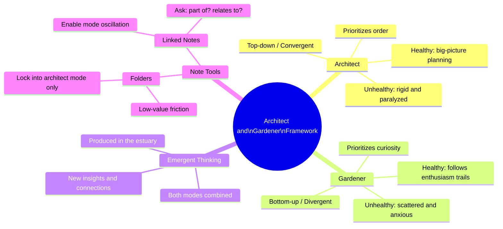
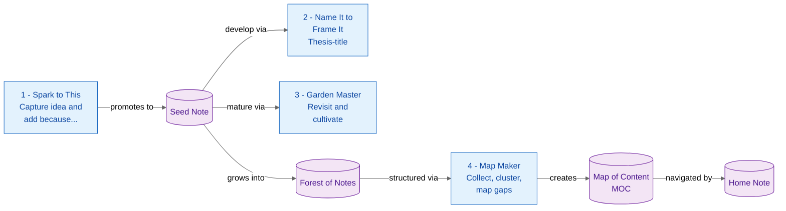

# The Architect and Gardener Framework — Summary

> Knowledge workers get stuck because they default to one cognitive mode — the Architect/Gardener framework teaches you to deliberately switch between structured top-down planning and curiosity-driven bottom-up exploration to generate emergent insights.

**Sources analyzed:** [This Secret Principle Will Transform Your Notes](https://www.youtube.com/watch?v=q0pQh69iPWA&list=PLw1ExsV_HfJ6r6I3VF-xeF4PtYiXA-8gF) — Nick Milo, Linking Your Thinking (PKM Summit, Netherlands, 2025)
**Generated:** 2026-07-28

---

## Problem Statement

People routinely get stuck on creative and intellectual projects — not for lack of ideas or time, but because they are locked into a single cognitive mode. Those who default to over-structuring (the "architect" tendency) experience fragile, rigid thinking: they cannot act without a complete map, they turn brainstorming sessions into prosecutions, and they are paralysed whenever their structure is incomplete. Those who default to free-associating (the "gardener" tendency) experience chronic scattered anxiety: they endlessly collect interesting material and never revisit it, they lose track of their own ideas, and they cannot find things when needed.

Folder-based note systems compound the architect problem. Folders force a single decisive question — *in which folder does this idea exclusively belong?* — at precisely the wrong moment (during ideation) and generate friction without commensurate value. They double down on top-down thinking for people who already skew that way, while offering nothing to help gardeners structure their growing collections.

More fundamentally, people try to manage ideas the way they manage tasks. Tasks are finite, clear-scoped, and cross-offable; ideas are infinite, fuzzy, and non-linear. Applying task-management logic to ideas inevitably fails, triggering app-switching and system redesigns rather than productive output.

The result is that most people oscillate between chaotic collection and rigid reorganisation, never reaching the middle zone where both modes together produce emergent thinking — novel insights that were not present in any individual note before the two modes converged.

## Solution at a Glance

The Architect and Gardener framework (popularised by George R. Martin for fiction writers, rooted philosophically in Nietzsche's Apollonian/Dionysian duality) offers a mental model for cognitive self-regulation: recognise which of two modes — top-down Architect or bottom-up Gardener — is dominant in any given work session, identify when being stuck is a signal to switch modes, and use a linked-notes system (rather than a folder hierarchy) as the practical tool that makes switching fluid. The framework provides four named exercises — Spark to This, Name It to Frame It, Garden Master, and Map Maker — that operationalise the oscillation and guide knowledge workers from raw capture through emergent insight to communicable output.

---

## Part I: Conceptual Overview

### Purpose

The framework exists to make intellectual and creative progress *reliable*. Its core claim is that every problem-solving or creative effort requires both modes to produce original output: the Architect mode for convergence, clarity, and structure; the Gardener mode for curiosity, divergence, and serendipitous connection. No one succeeds by perfecting one mode — they succeed by becoming fluid at switching.

The framework treats "stuck" not as failure but as diagnostic information. Feeling confused, frustrated, overwhelmed, or bored is a signal that you are in the wrong mode for the current moment. Switching modes is the prescribed response, not trying harder in the same mode.

### Core Concepts

**Architect** — A top-down thinker who prioritises order and structure. Architects like to see the big picture before acting, prefer categorisation, and use macro-structure to guide decisions. They are comfortable making plans but can become paralysed without sufficient information and may stifle others by demanding premature clarity.

**Gardener** — A bottom-up thinker who prioritises curiosity and chaos. Gardeners follow trails of enthusiasm without needing a high-level plan, work well with limited information, and generate many ideas. They can produce chronic anxiety by collecting without organising and losing access to their own thinking.

**Emergent Thinking** — The output produced when both modes operate in sequence. The Architect converges on structure; the Gardener diverges into connections; where the two meet (the "estuary" between river and sea) new insights form that were not derivable from either mode alone.

**Convergent thinking** (healthy Architect) — Seeing the big picture, categorising, and using structure to advance decision-making and sense-making.

**Divergent thinking** (healthy Gardener) — Generating many thoughts, following enthusiasm clues, connecting disparate ideas without needing a predetermined destination.

**Oscillation** — The deliberate act of switching from one mode to the other. The framework's entire practical value lies in normalising and enabling this switch.

**Linked notes vs. folders** — Folders ask "in which folder does this idea exclusively belong?" — a low-value, high-friction question that forces the architect mode. Links ask tacitly: "What is this a part of?" (Architect), "What does this relate to?" (Gardener), and "So what — why do I care?" (emergent). These are generative, high-value questions that produce sense-making as a by-product.

### Strengths

- **Universal applicability.** The framework applies to writing, research, project planning, business strategy, fiction, and personal sense-making — anywhere ideas need to develop over time.
- **Diagnostic power.** Labelling "stuck" states (confused, bored, overwhelmed, frustrated) as mode-switching signals gives practitioners an immediate, actionable response rather than a vague sense of failure.
- **Validates natural behaviour.** The framework does not ask people to change their personality. Natural architects are not told to abandon structure; natural gardeners are not told to plan more. Both tendencies are legitimised and directed toward productive oscillation.
- **Works across scales.** The same oscillation logic applies in a 10-minute note-taking session, a multi-month writing project, and in real-time meetings with collaborators.
- **Linked-notes alignment.** Tools like Obsidian implement linking natively, making the gardener-to-architect switch mechanically easy: a link implicitly asks both "what is this a part of?" and "what does this relate to?" simultaneously.

### Weaknesses

- **Requires self-awareness.** The framework's prescriptions only work if practitioners can reliably diagnose which mode they are currently in and recognise stuck states quickly. This metacognitive skill is not automatic and takes practice to develop.
- **Doesn't prescribe a specific tool.** While linked notes are advocated over folders, the framework says little about which app, what structure within that app, or how to handle the inevitable messiness of a growing note graph.
- **No quantitative guidance.** How often to switch, how long to stay in each mode, and when emergent thinking has "happened" are left to intuition. Beginners may struggle to calibrate.
- **Overlap with established frameworks.** The Architect/Gardener vocabulary is less academically grounded than GTD (David Allen), Zettelkasten (Luhmann), or Evergreen Notes (Andy Matuschak). Practitioners familiar with these may find the framework adds a useful meta-layer but is not a standalone system.

### Tradeoffs

- **Gain: reduced friction when capturing ideas / Give up: immediate organisation.** Linked notes let you capture without deciding where something lives, but the cost is that a growing forest of notes can become hard to navigate without deliberate map-making.
- **Gain: serendipitous connections / Give up: predictable retrieval.** A graph of linked notes surfaces unexpected relationships (emergent thinking) but makes it harder to retrieve a specific item by browsing a known hierarchy.
- **Gain: ownership and personalisation / Give up: standardisation.** Writing notes in your own words ("making notes" vs. "taking notes") builds personal meaning and memorable connections but is slower and harder to outsource than copying or highlighting.
- **Gain: creative momentum / Give up: completion certainty.** The gardener mode generates energy and new directions but can extend projects indefinitely; the architect mode closes things off but can stifle mid-project discovery.

### Costs & Caveats

Adopting the framework requires a linked-notes system (Obsidian is the implicit tool throughout the talk). Migrating from a folder-only system carries a one-time reorganisation cost. The real ongoing cost is attention: making notes rather than taking notes requires active engagement with every piece of captured information, which is slower than passive highlighting or copy-pasting.

The framework is presented via a live conference talk, not a peer-reviewed study. Claims about "emergent thinking" and "intellectual assets" are plausible and consistent with cognitive science literature on associative thinking, but are not empirically validated in the talk itself. The practical exercises (detailed in Part II) are heuristics, not algorithms — their value depends heavily on consistency of practice.

For teams and organisations, the framework is described only for individuals. Collaborative note systems, shared maps of content, and multi-author knowledge graphs are not addressed.

---

## Part II: Technical & Architectural Overview

> *Included because the source specifies implementation details.*
> *Partially included — the practical exercises and note hierarchy are specified; specific tool configuration and Obsidian setup are not.*

### Architecture Overview

The workflow has two layers: a **note hierarchy** (the structural backbone) and **four named exercises** (the repeating practices that populate and develop that structure). The hierarchy runs from the most atomic unit (a seed/fleeting note) upward through an expanding forest of linked notes, to mid-level Maps of Content (MOCs), and finally to a navigational Home Note. The exercises are not sequential phases but recurring practices applied at different points of the workflow depending on whether the practitioner is in Gardener or Architect mode.

### Key Components

**Seed Note** — The atomic unit. A raw, fleeting idea, usually first captured in a daily note. At this stage it may be a single sentence. Its defining feature is that it exists and has been touched by the practitioner's own words and a "because" connection.

**Forest of Notes** — The collection of all developed notes in the system. Analogous to a Zettelkasten. Notes in the forest have been named, linked to other notes, and revisited at least once. This layer is intentionally messy and non-hierarchical; richness and inter-connection are the value.

**Map of Content (MOC)** — A higher-order note whose primary content is links to other notes, grouped and clustered by the practitioner. MOCs are created bottom-up (not imposed top-down): they arise when the practitioner notices a mental squeeze point and decides to organise a cluster of related notes. Multiple MOCs can co-exist and can link to each other. They are the Architect's tool applied to a Gardener's forest.

**Home Note** — The top of the navigational hierarchy. A single note (or small set of notes) that provides entry points into the most important MOCs and active projects. It has the most structure and the least content.

### Technology Choices

The framework is tool-agnostic in principle but is demonstrated throughout with **Obsidian** (implied by references to "linked notes," "map of content," and backlinks). Any linked-notes application implementing bidirectional links and a graph view is compatible — Roam Research, Logseq, and similar tools are equivalent alternatives. The framework explicitly does *not* work with folder-only systems (Finder, traditional file hierarchies, early Evernote) because folders eliminate the gardener's question ("what does this relate to?") and replace it with the architect's forced question ("where does this exclusively live?").

No specific Obsidian plugins, settings, or templates are prescribed. The note-naming convention implied by "Name It to Frame It" aligns with Andy Matuschak's Evergreen Notes convention (note titles as complete assertions), but the talk distances itself from requiring full Evergreen-note compliance.

### Data Flows

**Gardener-mode flow (capture → seed):**
A daily note becomes a capture surface. Something interesting is encountered; the practitioner writes it in their own words and appends "...because [reason]." The resulting thought is not filed but left in the daily note or promoted into a new seed note. The key moment is the "because" — it is the smallest unit of sense-making.

**Architect-mode flow (forest → MOC):**
When the practitioner hits a "mental squeeze point" (overwhelm, confusion, loss of direction), they switch to Architect mode and create a Map of Content. All notes related to a topic are pulled into a single working note. The practitioner then *clusters* them — grouping related notes together — and observes the *negative space* (gaps between clusters). Each gap is a potential new note representing an insight that was not yet explicit. The Map of Content is then saved as a navigational asset.

**Garden Master cycle (seed → richer note):**
A seed note is revisited on subsequent days or weeks. Each visit may add a new idea, a connection to a recently read concept, or a refinement of the thesis-title. The note grows incrementally without any single session needing to produce a finished product. The example given is a note titled "magic to mundane meter" that evolved over weeks from a one-liner into a publishable article incorporating Arthur C. Clarke's quote.

---

## External References

- [George R. Martin on Architects and Gardeners](https://en.wikipedia.org/wiki/George_R._R._Martin) — Origin of the Architect/Gardener metaphor for fiction writers; popularised in interviews about his writing process
- [Nietzsche — The Birth of Tragedy (Apollo vs. Dionysus)](https://en.wikipedia.org/wiki/The_Birth_of_Tragedy) — Philosophical root of the Architect/Gardener duality; Apollonian (order/logic) vs. Dionysian (chaos/emotion) thinking modes
- [Andy Matuschak — Evergreen Notes](https://notes.andymatuschak.org/Evergreen_notes) — Linked-notes methodology that informs "Name It to Frame It"; note titles as complete, precise assertions
- [David Allen — Getting Things Done (GTD)](https://gettingthingsdone.com/) — Mind Sweep technique referenced as the gold standard for task management; contrasted with idea management
- [Steuart Brand — Pace Layers](https://jods.mitpress.mit.edu/pub/issue3-brand/release/2) — Concept referenced as an example of an idea worth linking rather than filing
- [Arthur C. Clarke — "Any sufficiently advanced technology is indistinguishable from magic"](https://en.wikipedia.org/wiki/Clarke%27s_three_laws) — Quoted in the Garden Master example as a connection that enriched a developing note
- [Isaac Asimov — Foundation (Seldon Crisis)](https://en.wikipedia.org/wiki/Foundation_(Asimov_novel)) — Example of a personal note born from reading a novel during the 2020 US election; illustrates the "Name It to Frame It" practice
- [Herman Hesse — Siddhartha and The Glass Bead Game](https://en.wikipedia.org/wiki/Hermann_Hesse) — Example cited to illustrate "great works are flavored by early works"; the note title is itself a demonstration of "Name It to Frame It"
- [Obsidian](https://obsidian.md/) — The implied linked-notes tool throughout the talk; Nick Milo's YouTube channel focuses on Obsidian workflows
- [Zettelkasten](https://zettelkasten.de/) — Referenced as a conceptual ancestor of the "Forest of Notes" layer; note-slip box methodology developed by Niklas Luhmann
- [PKM Summit](https://pkmsummit.com/) — The conference at which this talk was delivered (Netherlands, 2024/2025); links to future events mentioned in the video

---

## Source Material

- [This Secret Principle Will Transform Your Notes](https://www.youtube.com/watch?v=q0pQh69iPWA&list=PLw1ExsV_HfJ6r6I3VF-xeF4PtYiXA-8gF) — Nick Milo, *Linking Your Thinking*, PKM Summit talk (~40 min)

---

## Key Takeaways

- **"Stuck" is a mode signal, not a failure.** Confusion, boredom, overwhelm, and frustration are diagnostic information: they mean you need to switch modes (Architect → Gardener or vice versa), not push harder in the same direction.
- **Folders and links ask fundamentally different questions.** Folders ask "where does this exclusively live?" (low-value friction). Links ask "what is this a part of?" and "what does this relate to?" (high-value sense-making). This single distinction determines whether your note system locks you into one cognitive mode or enables both.
- **Note-making is inherently high-value; note-taking is not.** Writing in your own words and forcing a "because" connection (the Spark to This exercise) is almost impossible to make worthless — the act of making the note *is* the sense-making.
- **Clustering is the generative act.** When notes are placed physically adjacent on a Map of Content, the negative space between clusters reveals insights that were not yet explicit — ideas that the practitioner did not know they had until the clustering made them visible.
- **Both archetypes are always present.** No one is purely an Architect or purely a Gardener. The framework is not about identifying your type and staying in it — it is about recognising which tendency is over-expressed in a given moment and correcting the imbalance.

---

## Conclusion

The Architect and Gardener framework is an emerging but well-circulated mental model in the Personal Knowledge Management (PKM) community, with roots in long-standing philosophical and literary traditions. It is best suited to knowledge workers, writers, and researchers who already use or are considering a linked-notes tool like Obsidian and who find themselves either chronically over-structuring or chronically under-organising their ideas. The framework's most important practical caveat is that it is a metacognitive habit system, not a software feature — its value accrues only with consistent, deliberate practice of the four exercises, and it requires enough self-awareness to catch stuck states in real time. Practitioners who already have an established note-taking workflow will find it easier to layer onto existing habits than beginners building from scratch.
