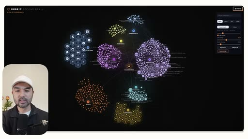
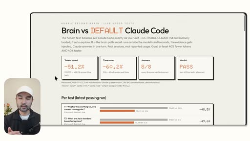
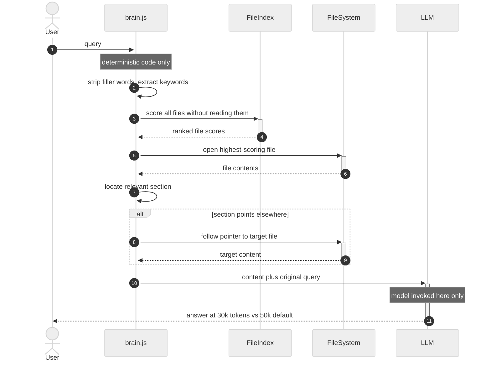
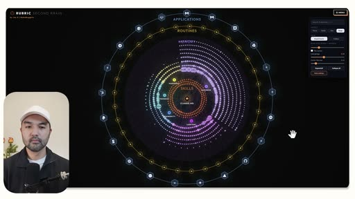
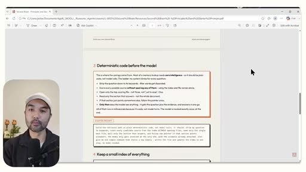
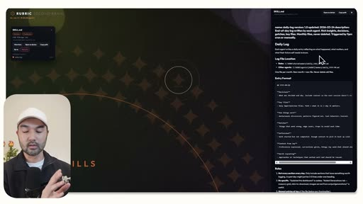

# Claude Code Second Brain — Summary

> Default Claude Code burns 50% more tokens searching for files with grep and glob; a layered Second Brain built with Claude Fable 5 uses deterministic JavaScript retrieval to cut token costs by ~40% and return answers faster.

**Sources analyzed:** [Build your Ultimate Second Brain with Claude Fable 5 (before it's too late)](https://youtu.be/VoKiKvgpk78)
**Generated:** 2026-07-28

---

## Problem Statement

Claude Code, in its default configuration, has no efficient memory system. When asked to find a file or retrieve a fact, it reaches for `grep` and `glob` — tools that read broadly across the filesystem, accumulate tokens rapidly, and return answers slowly. In a benchmark shown in the video, a default Claude Code session consumed around 50,000 tokens to answer a straightforward retrieval question, while the same query resolved in roughly 30,000 tokens with the Second Brain system — a ~40% overhead for every lookup, compounding across hundreds of daily interactions.

The second concrete failure is visibility. Users who rely on Claude Code accumulate connected applications, running background routines, and skill files over time, but have no dashboard to see the whole picture at once. This creates both trust risk (Claude can act on all connected apps) and maintenance debt (forgotten automations keep running, unused integrations stay authorized). Tools like Obsidian attempt to address this with graph views, but the presenter argues these are decorative — they show connections but provide no actionable information about file contents, connection counts, or operational status.

The third problem is onboarding and communication: explaining a Claude Code workspace to a client or team member by navigating folder trees is difficult. Without a visual, structured representation, the "agentic operating system" concept remains abstract and hard to audit.

## Solution at a Glance

Claude Fable 5 is used to design and build a custom Second Brain system for your Claude Code workspace. The system has two interlocking parts: a visual graph dashboard called Rubric that organises the workspace into four semantic layers (Applications, Routines, Memory, Skills), and a deterministic JavaScript retrieval engine (`brain.js`) that indexes all files, scores candidates without reading them, and only opens the single most relevant file — bypassing model calls entirely until the final answer step. The result is a workspace that retrieves information faster, costs fewer tokens, and is navigable at a glance.

---

## Part I: Conceptual Overview

### Purpose

The Second Brain exists to make the full power of Claude Code sustainable. As a workspace grows — more connected apps, more scheduled routines, more reference files — the default search approach scales poorly: every lookup is a token-expensive trawl. The Second Brain inverts this by front-loading structure: the model maps and indexes everything once, then retrieval becomes a cheap, deterministic lookup rather than an open-ended search.

A secondary purpose is governance. The visual dashboard makes it easy to see which external applications are authorized, which routines are active, and what skills exist — letting users prune unused connections, reduce attack surface, and communicate the system to others.

### Core Concepts

The system is organised around four layers, which together form what the presenter calls an "agentic operating system":

- **Applications** — every tool, MCP connector, API, or CLI connected to Claude Code. More nodes = more power, but also more trust surface. The visual layer makes it easy to spot tools you forgot you connected or that you no longer use.
- **Routines** — scheduled background tasks. Similar to Applications: visible quantity signals automation leverage, but stale routines are worth retiring.
- **Memory** — the indexed file collection. In the presenter's setup this is 35,466 files. The Second Brain maps relationships between these nodes so retrieval is guided, not brute-force.
- **Skills** — reusable prompt/agent files. The graph shows which skills are connected to which files and routines, making the dependency structure navigable.

The visual dashboard (Rubric) renders all four layers as a dark-background force graph with colour-coded clusters by department (Business, Content, Personal, Community).

```mermaid
%%{init: {'theme': 'neutral'}}%%
graph LR
    classDef problemCls fill:#ffebee,stroke:#c62828,color:#b71c1c
    classDef solutionCls fill:#e8f5e9,stroke:#2e7d32,color:#1b5e20
    classDef layerCls fill:#e3f2fd,stroke:#1565c0,color:#0d47a1
    classDef dashCls fill:#fff3e0,stroke:#e65100,color:#bf360c

    subgraph Problems["Pain Points"]
        direction TD
        P1["Slow retrieval\ngrep / glob"]
        P2["High token cost\n~50k tokens per query"]
        P3["No workspace\nvisibility"]
        P4["Decorative graphs\nno functional value"]
    end

    S["Second Brain\nDeterministic Retrieval"]

    subgraph Layers["Four Layers"]
        direction TD
        L1["Applications\nMCPs · APIs · CLIs"]
        L2["Routines\nScheduled automations"]
        L3["Memory\n35k+ indexed files"]
        L4["Skills\nReusable agents"]
    end

    V["Rubric\nVisual Dashboard"]

    Problems -->|"solved by"| S
    S -->|"organises into"| Layers
    S -->|"visualised by"| V
    V -->|"displays"| Layers

    class P1,P2,P3,P4 problemCls
    class S solutionCls
    class L1,L2,L3,L4 layerCls
    class V dashCls
```

### Strengths

**Token efficiency is real and measurable.** The presenter shows a live benchmark: second brain session uses ~30k tokens, default uses ~50k, for the same retrieval task. The benchmark is then reproduced by Fable itself across multiple test cases, with consistent savings in the 40–50% range.

**Speed advantage is immediate.** In the side-by-side demo, the second brain session returns an answer while the default session is still searching — the deterministic path simply has fewer steps.

**Visual governance.** The Rubric dashboard gives instant visibility into application connections and active routines, making auditing practical. A user can "eyeball which particular applications to disconnect" rather than hunting through configuration files.

**Generalisable structure.** The four-layer framework (Applications, Routines, Memory, Skills) applies to individual, team, or client workspaces equally. The presenter explicitly frames it as a deliverable for client engagements.

**Self-optimising with `/goal`.** Fable can be directed to set performance goals (e.g., "load under 10 seconds") and check its own work continuously, building in a feedback loop without manual benchmarking.

### Weaknesses

**Workspace-specific, not universal.** The presenter is explicit: "the system that works for me may not work for you." The brain.js retrieval logic was designed around their own index structure. Another workspace with different naming conventions or folder organisation would need a bespoke build.

**Index maintenance overhead.** A 35,000-file workspace that is indexed once will drift as files are added, renamed, or deleted. The video does not address how the index is kept current — whether it is rebuilt on demand, incrementally updated, or triggered by file-system events.

**Visual dashboard is optional complexity.** The Rubric graph is presented as a nice-to-have that captures only "30% of the value." For users who only want the retrieval savings, the visual layer adds build effort without directly delivering the core benefit.

**Requires Fable-level capability to build.** The presenter frames this as something to do "while Fable 5 is part of your subscription" under non-usage-based pricing. Building a custom retrieval engine and visual graph with a less capable model may produce inferior results.

### Tradeoffs

- **Gain: ~40% token savings per retrieval / Lose: upfront build investment** — Fable needs to scan, map, and index the workspace, generate brain.js, and validate it before any savings are realised.
- **Gain: deterministic, predictable retrieval / Lose: flexibility** — the deterministic approach is fast because it makes assumptions about index structure. Ambiguous or cross-domain queries that don't match the keyword scoring model may fall through to slower paths.
- **Gain: visual workspace overview / Lose: additional surface to maintain** — the Rubric dashboard must be kept in sync with actual workspace state; an outdated graph gives false confidence about what is connected.
- **Gain: cleaner client communication / Lose: abstraction distance** — the graph view conceals the folder structure that some users find more intuitive.

### Costs & Caveats

The main adoption cost is time with Fable: the presenter implies a meaningful session of guided exploration and code generation is required to produce a well-fitted system. The PDF guide provided in the video's pinned comment is meant to shorten this, but it does not replace the need to let Fable scan and understand your specific workspace.

The "non-usage-based pricing window" framing is a real caveat: the presenter's implicit argument is that this kind of heavy, exploratory build session is affordable now but would be expensive under per-token pricing. The savings argument may flip if the build cost exceeds lifetime retrieval savings for smaller workspaces.

The retrieval engine's effectiveness depends directly on index quality. Without well-structured markdown files with meaningful headings and cross-references, the section-finding and pointer-following logic in brain.js has less to work with, and the savings will be smaller.

---

## Part II: Technical & Architectural Overview

> *Included because the source specifies implementation details.*
> *Partially included — the retrieval algorithm and four-layer structure are specified; the full brain.js source, index schema, and Rubric rendering implementation are not shown.*

### Architecture Overview

The system has two independent components that share the same workspace data:

1. **brain.js** — a deterministic JavaScript retrieval engine that runs as a Claude Code tool. It operates entirely without model calls during retrieval, using keyword extraction, file scoring, and section targeting to minimise the tokens consumed before the LLM sees any content.

2. **Rubric** — an interactive visual dashboard (rendered in a browser) that displays the workspace as a force-directed graph, with nodes grouped by department and coloured by layer (Applications in blue, Routines in yellow, Skills in white/small, Memory in various cluster colours). Clicking a node can open the underlying file directly.

The two components share the same indexed file collection but serve different use cases: brain.js optimises daily query throughput; Rubric provides periodic oversight and communication.

### Architecture Sequence

### Key Components

**brain.js** — The central retrieval script invoked at the start of every memory query. Its internal pipeline:
1. Keyword extraction — strips filler words ("which", "do we use", etc.) and retains semantic tokens ("TTS", "voice").
2. Index scoring — assigns each indexed file a relevance score using the extracted keywords, without opening any file. This is the key token-saving step.
3. Section targeting — once the top file is opened, the code locates the specific section most likely to contain the answer, rather than reading the whole document.
4. Pointer following — if the relevant section contains a reference to another file (a "pointer"), brain.js follows it deterministically. The model is not involved in this navigation.
5. Content packaging — the extracted content and original query are bundled and passed to the LLM for final answer generation.

**FileIndex** — A pre-built index (likely a JSON map of file paths to keyword/heading metadata) that brain.js queries during scoring. The exact schema is not shown but must be maintained in sync with the workspace.

**Rubric Dashboard** — A browser-based force-graph UI. Nodes represent files, skills, routines, and applications; edges represent connections. Departments are clustered spatially. Performance goals (load time < 10 seconds) are enforced via `/goal` commands that Fable monitors during iterative development.

**Hermes Agent** — The presenter's personal scheduled agent, shown as an example of the Routines layer. It runs a daily log skill on a schedule, illustrating how routines connect to skills in the graph.

### Technology Choices

- **JavaScript** — brain.js is written in JavaScript, runnable as a Claude Code tool. No framework dependency mentioned; likely plain Node.js.
- **Markdown** — the memory layer consists of markdown files with headings that brain.js can target at the section level.
- **Semantic search (optional)** — the QMD project (Query My Docs by Tobi Lütke) applies semantic/vector search principles; the presenter references it as a pattern Fable should consider when building the index.
- **Graph visualisation** — Rubric renders as a force-directed graph in the browser. The specific library is not named.
- **`/last-30-days` skill** — a Claude Code skill by Matt Van Horn used to pull recent best practices from Reddit, Twitter, YouTube, and Hacker News as research input for the build session.
- **`/goal` slash command** — a Claude Code mechanism for setting self-checking performance targets that Fable monitors during iterative work.

### Data Flows

**Retrieval flow (daily use):** User query → brain.js keyword extraction → index scoring (no reads) → single file open → section locate → optional pointer follow → LLM answer generation. The LLM touches the conversation only at step 6.

**Build flow (one-time setup):** `/last-30-days` research pull → Fable scans workspace → Fable reads reference repos (QMD, G Brain, Graphify) → Fable generates brain.js + index + Rubric code → Fable validates against `/goal` performance targets → system goes live.

---

## External References

- [Claude Code](https://claude.ai/code) — Anthropic's CLI agent; the platform the Second Brain runs on top of
- [Claude Fable 5](https://www.anthropic.com) — Anthropic's most capable model at time of recording; used to design and generate the system
- [/last-30-days skill](https://github.com/mvanhorn) — Claude Code skill by Matt Van Horn (co-founder of Lyft) that scrapes Reddit, Twitter, YouTube, and Hacker News for recent best practices on a topic
- [QMD (Query My Docs)](https://github.com/tobi) — open-source project by Tobi Lütke (founder of Shopify) applying semantic search principles to personal file collections
- [G Brain](https://github.com/garrytan) — personal second brain system by Garry Tan (CEO of Y Combinator); shared as a reference architecture
- [Graphify](https://github.com) — YC-funded open-source repository that creates semantic connections between files and folders; referenced as an additional pattern
- [Obsidian](https://obsidian.md) — popular graph-based note-taking and knowledge management tool; used as a comparison (the problem case of decorative-only graphs)
- [Rubric](https://rubric.ai) — the visual dashboard used to render the Second Brain graph (exact URL not confirmed in source)
- [Hermes Agent](https://youtu.be) — the presenter's personal scheduled Claude Code agent, referenced as an example of the Routines layer

---

## Source Material

- [Build your Ultimate Second Brain with Claude Fable 5 (before it's too late)](https://youtu.be/VoKiKvgpk78) — YouTube video by Jay E | RoboNuggets, 13:41

---

## Key Takeaways

- **The real value is in retrieval, not the graph.** The visual dashboard is a nice communication tool, but the presenter puts it at "30% of the value." The other 70% — and the measurable token savings — come from brain.js running deterministic code before the model ever sees a query.
- **Deterministic code before the model is the core design principle.** Every step brain.js handles without invoking the LLM (keyword extraction, file scoring, section targeting, pointer following) is a step that costs zero inference tokens. This is the architectural insight, and it applies beyond Second Brains to any retrieval-augmented Claude Code system.
- **Workspace-specific design is not a bug.** The presenter explicitly discourages copying their system verbatim and instead teaches the principles, because each workspace's index structure, file conventions, and query patterns are different. Effective adoption requires letting Fable analyse *your* workspace.
- **The four-layer model (Applications, Routines, Memory, Skills) is a useful audit framework independent of the Second Brain.** Even without brain.js, organising your Claude Code setup against these four dimensions reveals unused integrations, stale automations, and skill gaps.
- **Building with Fable while it is on flat-rate pricing is a strategic use of the subscription.** The build session is token-intensive; the ongoing savings are modest per query but compound over time. The ROI calculation depends on query volume and the pricing model in effect.

---

## Conclusion

The Claude Code Second Brain is an emerging, bespoke approach to workspace memory management that sits at the intersection of personal knowledge management and agentic system design. It is well-suited to power users who run Claude Code daily at scale and have a structured, markdown-heavy workspace where keyword-based indexing works reliably. The single most important caveat is that the system requires meaningful upfront investment with a capable model to build correctly, and ongoing maintenance to keep the index current — teams or individuals with rapidly changing file structures may find the maintenance cost erodes the retrieval savings over time.
