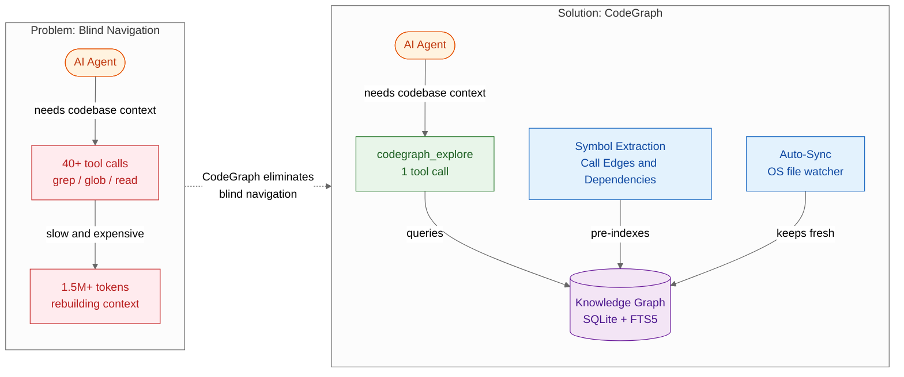
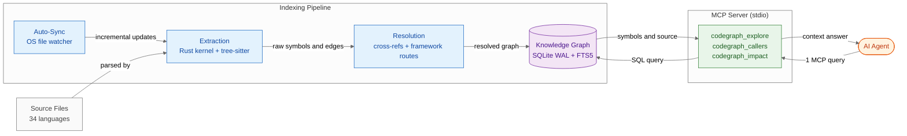

# CodeGraph — Summary

> AI agents waste dozens of tool calls and millions of tokens rebuilding codebase knowledge on every query — CodeGraph pre-builds a local knowledge graph so agents answer architectural questions in one tool call instead of forty.

**Sources analyzed:** [CodeGraph — GitHub Repository](https://github.com/colbymchenry/codegraph)
**Generated:** 2026-07-28

---

## Problem Statement

When an AI coding agent starts a new task on an unfamiliar codebase, it has no prior knowledge of the repo's structure. It must discover call paths, dependencies, and symbol locations the hard way: issuing grep, glob, and read commands one at a time, accumulating partial evidence until it has enough context to act. This "blind navigation" pattern is expensive in every measurable dimension. A benchmark on VS Code (~11k TypeScript files) shows that without CodeGraph, answering a single architectural question required 40 tool calls, consumed 1.5M tokens, cost $1.41, and took over three minutes.

The problem compounds with codebase size and language heterogeneity. A Rust project like Tokio required 57 tool calls and 4.3M tokens per question; a Swift project like Alamofire needed 53 calls and 3.1M tokens. Every session starts from scratch because agents have no persistent memory of the codebase's structure between invocations. There is no mechanism for an agent to ask "who calls this function?" or "what is the blast radius of changing this interface?" without manually tracing every reference by hand.

Existing code intelligence tools are either IDE-bound (not accessible to CLI agents), too heavy for local use (require cloud indexing pipelines, API keys, or large background processes), or language-specific. AI coding agents that operate over the Model Context Protocol have no standard mechanism for receiving pre-computed codebase structure — they receive only what their tool calls return in the moment.

---

## Solution at a Glance

CodeGraph is a local-first knowledge graph for source code that pre-indexes every symbol, call edge, import relationship, and cross-language bridge in a repository into a SQLite database, then exposes the graph to any MCP-compatible AI agent through a single tool call (`codegraph_explore`). Instead of guessing context through repeated file reads, the agent queries the pre-built graph and receives verbatim source grouped by file, call paths, and blast-radius analysis — all in one round-trip. The graph is kept current via native OS file watchers with debounced incremental sync, so the knowledge base never goes stale between agent sessions.

---

## Part I: Conceptual Overview

### Purpose

CodeGraph exists to close the context gap between what an AI agent knows and what a codebase contains. Its design philosophy is that an agent's first action should be understanding, not exploration — understanding that is cheap (one tool call), precise (call-path and blast-radius aware), and always current (auto-synced). The solution is built around the principle that static analysis work done once, offline, on the developer's machine, should not be redone from scratch by every agent invocation. Locality and privacy are first-class: the entire knowledge graph lives in a single SQLite file inside the project directory, with no API keys, no external services, and no code leaving the machine.

### Core Concepts

**Knowledge Graph** — A property graph stored in SQLite where nodes are code symbols (functions, classes, methods) and edges are relationships (calls, imports, extends, implements, framework routes, cross-language bridges). The graph supports full-text search via FTS5.

**Symbol Extraction** — The process of parsing source files into graph nodes and edges. The primary engine is a native Rust kernel that compiles tree-sitter grammars for 20 languages directly. Files that fail or whose language has no native grammar fall back to a portable WASM engine (web-tree-sitter + pre-compiled WASM grammars), producing byte-for-byte identical graphs.

**Call Edges and Impact Radius** — Directed edges from call sites to definitions, enabling two operations: tracing callees (what does this function call?) and callers (who calls this function?). The `codegraph_impact` tool computes the full blast radius of a change across N hops.

**MCP Server Interface** — CodeGraph runs as a stdio MCP server that any compatible agent can launch with `codegraph serve --mcp`. The primary tool `codegraph_explore` accepts a natural-language architectural question and returns pre-fetched, pre-grouped source context.

**Auto-Sync** — A native OS file watcher (FSEvents/inotify/ReadDirectoryChangesW) monitors the project for changes. Edits are debounced (default 2000ms) and synced incrementally, so the graph reflects the current working tree without requiring manual re-indexing.

### Strengths

**Dramatic reduction in agent overhead.** Across seven real-world benchmarks, CodeGraph reduces tool calls by up to 91%, token consumption by up to 89%, and cost by up to 86%. File reads dropped to zero on all seven repos, meaning the agent never had to blindly open a file — all source was surfaced by the graph query.

**Breadth of language and framework coverage.** 34 languages and 17 web frameworks are supported, including cross-language boundary detection (Swift↔ObjC, React Native legacy/TurboModules/Fabric, Expo Modules, Fabric view components). This breadth is unusual among local code intelligence tools, which typically cover 5–10 languages.

**Adaptive performance.** The Rust kernel reads real core counts (cgroup-aware) and honest available RAM, then sizes worker pools and caches accordingly. The Linux kernel (70k files, 2M symbols, 6.4M relationships) indexes in under 12 minutes on a 2-core/6GB VPS where competing tools run out of memory.

**Zero-configuration, fully local.** No API keys, no accounts, no cloud services. A one-line installer bundles the Node runtime; nothing needs to be compiled by the user. The graph is a single `.codegraph/codegraph.db` file inside the project directory.

**Programmatic API.** Beyond the MCP server, CodeGraph exposes a Node.js library API for embedding: `CodeGraph.init()`, `indexAll()`, `searchNodes()`, `getCallers()`, `buildContext()`, `getImpactRadius()`, and `watch()`. This supports custom agent frameworks and CI integrations.

### Weaknesses

**Small-repo floor effect.** For small, well-structured codebases (OkHttp at ~645 files, Gin at ~110 files), the benchmarks show marginal or no improvement in wall-clock time. An agent that can grep a small tree in milliseconds may not benefit measurably from the graph overhead. The token and cost savings remain, but latency parity or worse is possible.

**Cold-start indexing cost.** The initial `codegraph init` run is not instant — a large monorepo requires several minutes of CPU time for the Rust kernel to parse, resolve, and persist the graph. Users working in transient environments (CI containers, remote dev machines that are recreated frequently) may hit this cost on every session.

**Rust binary distribution.** The native kernel is a compiled Rust binary distributed as a platform-specific bundle. Users on unusual platforms or architectures outside {macOS, Linux, Windows} × {x64, arm64} would need to compile from source, which is a non-trivial setup step.

**Benchmark transparency gaps.** The benchmarks report "median of 4 runs" with Claude Opus 4.8. The methodology does not specify whether the agent prompt, temperature, or tool-use strategy was held constant across runs, nor whether the baseline (without CodeGraph) was using the same agent instructions. The results are plausible and directionally correct, but independent reproduction has not been published.

### Tradeoffs

**Single-query context vs. multi-step exploration** — You gain surgical, pre-computed context delivered in one round-trip; you give up the agent's ability to interactively drill down through intermediate results. If the knowledge graph misses a relationship or the initial query is poorly formed, there is no partial-information fallback visible to the agent.

**Local storage vs. cloud collaboration** — You gain full privacy and zero latency (no network calls); you give up shareable indexes. Each developer's machine maintains its own `.codegraph/` directory — there is no mechanism to publish or cache a team-shared index.

**Rust kernel vs. pure JS/TS tool** — You gain native performance and memory efficiency for large repos; you give up the simplicity of a single-language tool. The Rust kernel adds a compiled artifact to the distribution, a separate build step (`build:kernel`), and platform-specific binary management.

**Pre-built index vs. always-fresh analysis** — You gain fast query responses; you give up real-time accuracy during the debounce window. The watcher flags stale files with a `⚠️` banner, but the agent may still receive slightly outdated information for files edited within the last 2 seconds.

### Costs & Caveats

**Initial indexing time** must be budgeted for large repos. The documented worst case is ~12 minutes for a 70k-file repo on a 2-core VPS; a typical 1k–5k file project indexes in seconds.

**Node.js version constraint for library embedding**: the programmatic API requires Node 22.5+ (for `node:sqlite`); the CLI and MCP server do not have this requirement (the binary bundles its own runtime).

**Staleness during the debounce window**: changes are not immediately reflected. Files edited in the last 2 seconds (configurable via `CODEGRAPH_WATCH_DEBOUNCE_MS`) appear with a staleness warning but may return old content. For agents that write and immediately re-query, this is a meaningful caveat.

**Anonymous telemetry is opt-out, not opt-in.** It collects only command/tool usage and language counts (no code, paths, or queries), but teams with strict data governance policies must explicitly disable it.

---

## Part II: Technical & Architectural Overview

> *Included because the source specifies implementation details.*

### Architecture Overview

CodeGraph is a four-layer system: a Rust parsing kernel at the bottom, a SQLite persistence layer above it, an MCP server as the agent-facing interface, and a file watcher for incremental sync. The Rust kernel and TypeScript MCP server are separate compilation artifacts bundled together into platform-specific self-contained packages. The SQLite database uses WAL (Write-Ahead Logging) mode for concurrent read access and FTS5 for full-text symbol search. The MCP server communicates over stdio, which means the agent process spawns `codegraph serve --mcp` as a child process — there is no network port to manage.

### Key Components

**Rust Kernel (`codegraph-kernel/`)** — The native parsing engine. Compiles tree-sitter grammars for 20 languages into the binary. Implements the adaptive performance system: reads real core counts (cgroup-aware on Linux) and available RAM (using macOS `sysctl` and Linux `/proc/meminfo`), then sizes worker pools and resolution caches accordingly. The WASM fallback path (`web-tree-sitter` + `tree-sitter-wasms`) is invoked per-file when the native grammar is unavailable or fails, and is verified byte-for-byte against native output.

**SQLite Schema (`src/db/schema.sql`)** — Stores symbols (id, kind, name, file, line range, source text), edges (caller_id → callee_id, edge type, weight), files (path, mtime, language, indexed_at), and an FTS5 virtual table over symbol names and docstrings. WAL mode enables concurrent reads while indexing continues.

**Resolution Engine** — Post-extraction pass that resolves raw references to definitions. Handles: function calls → definition nodes, import paths → source file nodes, class inheritance and interface implementation edges, framework-specific patterns (17 web frameworks' route→handler edges), and cross-language bridges (Swift↔ObjC, React Native, Expo Modules, Fabric).

**MCP Server (`src/mcp/`)** — stdio transport. Primary tool `codegraph_explore` accepts a natural-language question and returns verbatim source grouped by file, with call paths and blast-radius analysis pre-computed. Secondary tools (`codegraph_node`, `codegraph_search`, `codegraph_callers`, `codegraph_callees`, `codegraph_impact`, `codegraph_files`, `codegraph_status`) are unlisted by default and re-enabled via `CODEGRAPH_MCP_TOOLS` environment variable. Multi-project support: each query can pass a `projectPath` parameter to target a different repo.

**Auto-Sync Watcher** — Uses native OS file event APIs (FSEvents on macOS, inotify on Linux, ReadDirectoryChangesW on Windows). Changes are debounced, filtered to source-file extensions, and synced incrementally. A connect-time reconciliation on session start catches any changes that occurred while no watcher was running. Staleness banner (`⚠️`) warns the agent when a queried file changed during the debounce window.

**CLI (`src/bin/codegraph.js`)** — 20+ commands covering the full lifecycle: `install` (wire up MCP config for Claude Code, Cursor, etc.), `init` (create `.codegraph/`), `index` / `sync` (manual indexing), `explore` / `query` / `callers` / `callees` / `impact` (direct graph queries), `daemon`, `telemetry`, and `upgrade`.

### Technology Choices

| Technology | Role | Mandated? |
|---|---|---|
| **Rust** | Native parsing kernel (`codegraph-kernel/`) | Mandated — performance-critical path |
| **TypeScript + Node.js** | MCP server, CLI, library API | Mandated |
| **tree-sitter** | Grammar-based parsing engine (native + WASM) | Mandated |
| **SQLite (WAL + FTS5)** | Knowledge graph persistence and full-text search | Mandated |
| **web-tree-sitter + tree-sitter-wasms** | Portable WASM fallback grammar engine | Mandated |
| **MCP stdio transport** | Agent interface protocol | Mandated |
| **commander** | CLI argument parsing | Implementation detail |
| **vitest** | Test runner | Implementation detail |
| **@clack/prompts** | Interactive installer UI | Implementation detail |
| **ignore + picomatch** | `.gitignore` and glob pattern matching | Implementation detail |

### Data Flows

**Initial indexing flow:**
1. User runs `codegraph init` or `codegraph index`
2. CLI discovers all source files, respecting `.gitignore` and `codegraph.json` excludes
3. Rust kernel parses each file with the appropriate tree-sitter grammar (native or WASM fallback)
4. Extracted symbols and raw edges are written to SQLite
5. Resolution engine runs a second pass to resolve cross-references, framework routes, and cross-language bridges
6. FTS5 index is built over all symbol names
7. File watcher starts; `codegraph serve --mcp` is ready to accept queries

**Agent query flow:**
1. Agent invokes `codegraph_explore` with a natural-language question
2. MCP server parses the question and constructs a SQL query against the knowledge graph
3. SQLite returns matching symbols, their source text, and connected edges
4. MCP server assembles the response: verbatim source grouped by file, call paths, impact radius
5. Agent receives the response as a single MCP tool result — no further file reads needed

**Incremental sync flow:**
1. Developer edits a file
2. OS file watcher fires an event; watcher debounces for 2000ms (configurable)
3. Only the changed file is re-extracted and re-resolved
4. SQLite rows for that file are updated atomically
5. Next agent query receives the updated graph; if the query arrives during the debounce window, the affected file is flagged with `⚠️`

---

## External References

- [tree-sitter](https://tree-sitter.github.io/tree-sitter/) — Incremental, error-tolerant parsing library used as the grammar engine
- [web-tree-sitter](https://github.com/tree-sitter/tree-sitter/tree/master/lib/binding_web) — WebAssembly bindings for tree-sitter, used as the portable fallback parser
- [tree-sitter-wasms](https://github.com/nickel-lang/nickel/tree/master) — Pre-compiled WASM grammar files for all supported languages
- [SQLite FTS5](https://www.sqlite.org/fts5.html) — Full-text search extension for SQLite used for symbol name search
- [Model Context Protocol (MCP)](https://modelcontextprotocol.io/) — The protocol CodeGraph uses to expose tools to AI agents
- [better-sqlite3](https://github.com/WiseLibs/better-sqlite3) — Node.js SQLite bindings (used for TypeScript types; the CLI uses Node's native `node:sqlite` on Node 22.5+)
- [commander](https://github.com/tj/commander.js) — Node.js CLI argument parsing library
- [vitest](https://vitest.dev/) — Unit test runner for TypeScript
- [@clack/prompts](https://github.com/natemoo-re/clack) — Interactive CLI prompt library used in the installer
- [ignore](https://github.com/kaelzhang/node-ignore) — `.gitignore`-style pattern matching library
- [picomatch](https://github.com/micromatch/picomatch) — Glob pattern matching for file filtering
- [jsonc-parser](https://github.com/microsoft/node-jsonc-parser) — JSONC (JSON with comments) parser for `codegraph.json` config files
- [SLSA Build Level 2](https://slsa.dev/) — Supply chain security attestations attached to GitHub Release bundles
- [Claude Code](https://claude.ai/code) — One of the supported AI agent runtimes
- [Cursor](https://cursor.com/) — One of the supported AI agent runtimes
- [CodeGraph documentation site](https://colbymchenry.github.io/codegraph/) — Official docs
- [CodeGraph hosted product waitlist](https://getcodegraph.com/) — Hosted/commercial version

---

## Source Material

- [CodeGraph — GitHub Repository (colbymchenry/codegraph)](https://github.com/colbymchenry/codegraph)

---

## Key Takeaways

- **The core insight is pre-computation, not smarter searching.** CodeGraph doesn't make grep faster — it eliminates grep entirely by building the knowledge graph once and reusing it across every agent session. The 89% reduction in tool calls flows directly from this shift.
- **The "one tool call" guarantee is only as good as the initial query.** `codegraph_explore` answers the question as asked; if the question misses the relevant subsystem, the agent gets a precise answer to the wrong question. The tool does not replace agent judgment about what to ask.
- **Small repos see cost savings but not always time savings.** The floor effect is real: agents can grep a 110-file repo faster than the MCP round-trip adds up. CodeGraph's value scales with codebase size — it's a strong fit for repos with 1k+ files and weak or neutral for toy repos.
- **Cross-language bridging is a genuine differentiator.** Most code intelligence tools treat language boundaries as hard stops. CodeGraph's Swift↔ObjC and React Native bridge tracking is rare and directly addresses the class of questions that are hardest for agents to answer (why is this native method unreachable from JS?).
- **Local-first is both a strength and a constraint.** The zero-external-service design is a meaningful security and privacy guarantee, but it also means no shared team index, no cloud-hosted search, and no way to offload indexing from the developer's machine.

---

## Conclusion

CodeGraph is an emerging but technically mature tool (v1.5.0, 62k+ stars, 774 commits) that addresses a well-documented inefficiency in AI coding agents: the repeated cost of re-exploring large codebases from scratch. It is best suited to teams working on repos with thousands of files, polyglot codebases with non-trivial cross-language boundaries, or workflows where agent token costs are a meaningful concern. The most important caveat for adoption is the cold-start indexing investment and the requirement to keep the `.codegraph/` database current — teams that work across many repos or frequently discard their working environments will see the highest overhead. For stable, large, single-repo workloads, the 60–90% reduction in agent tool calls and token consumption is a compelling reason to adopt.
