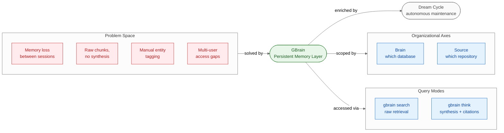
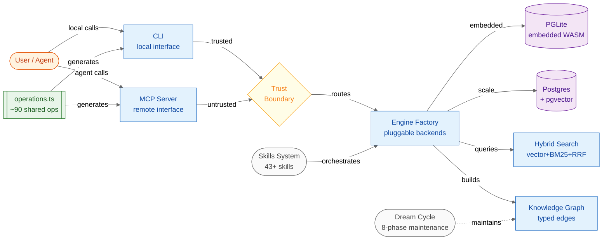

# GBrain — Summary

> AI agents forget everything between sessions — GBrain gives them a persistent, queryable memory layer that synthesizes cited answers from hybrid vector/graph search instead of dumping raw chunks.

**Sources analyzed:** [GBrain llms-full.txt](https://raw.githubusercontent.com/garrytan/gbrain/master/llms-full.txt)
**Generated:** 2026-07-28

---

## Problem Statement

AI agents are stateless by default: every new conversation begins with a blank slate, and anything learned in a prior session must be re-discovered or re-injected through context stuffing. As knowledge accumulates across hundreds or thousands of documents — meeting notes, essays, research, code — re-loading enough context to answer a question becomes expensive, lossy, and eventually impossible within a model's context window.

Traditional retrieval approaches compound the problem. A vector search returns the top-k most similar chunks, handing the agent a pile of raw paragraphs and leaving synthesis, deduplication, and gap detection as the agent's burden. The result is inconsistent answers, missed relationships, and no awareness of what the knowledge base *doesn't* contain. Hybrid keyword + vector search improves precision but doesn't change the fundamental "here are relevant pages — figure it out yourself" contract.

Constructing a useful knowledge graph from those documents requires either manual tagging of entity relationships or expensive LLM extraction passes. Neither scales: manual tagging is human labour, and LLM-per-document extraction at thousands of files quickly becomes cost-prohibitive and a latency bottleneck.

Finally, shared institutional deployments face an access control problem. When multiple users store sensitive information in the same system — personnel decisions, deal memos, confidential strategy — a single knowledge base without scoping is a liability. Agents retrieve everything regardless of caller permissions, turning a productivity tool into a data-exposure surface.

## Solution at a Glance

GBrain is a personal knowledge brain and agent infrastructure layer that maintains a persistent, schema-based database of markdown documents, automatically extracts entity relationships into a typed-edge knowledge graph without any LLM calls, and answers queries by either returning raw ranked results (`gbrain search`) or composing synthesized prose with inline citations and explicit gap analysis (`gbrain think`). It is designed to be mounted by AI agents via MCP (Model Context Protocol) or used directly via CLI, with pluggable database backends — embedded PGLite for zero-config or Postgres + pgvector for scale — and a configurable access-control model scoped along two orthogonal axes: which brain (database) and which source (document collection within it).

---

## Part I: Conceptual Overview

### Purpose

GBrain exists to give AI agents compound memory — the kind of institutional knowledge that accumulates value over time rather than evaporating at session end. The design philosophy distinguishes it sharply from retrieval-augmented generation bolted onto a chat product: GBrain is infrastructure, not a chat feature. It is built to run autonomously overnight via a `gbrain dream` cron job, continuously enriching and consolidating the knowledge base while the human sleeps. The long-term value proposition is that an agent using GBrain should produce *better answers* the longer the system has been running, not just the same answers faster.

The system is positioned as a companion to GStack, a sister project teaching agents how to code. GBrain handles "everything else" — the non-code institutional knowledge layer that accumulates from meetings, research, essays, and relationship history.

### Core Concepts

GBrain introduces two orthogonal axes that govern all knowledge routing and access:

- **Brain**: Which database the knowledge lives in. A user can maintain a personal brain and also mount team-published brains, each with its own database and access policy.
- **Source**: Which document collection (repository) within a brain. A single brain holds multiple sources — a personal wiki, curated essays, a project's documentation — each with independent slug namespaces.

Both axes resolve settings through an identical six-tier configuration chain (per-call parameter → environment variable → per-source DB key → brain-wide DB key → workspace YAML → user config → hardcoded default), giving operators fine-grained control without coupling configurations across scopes.

The two query modes define the system's output contract:

- **`gbrain search`**: Raw retrieval. Returns top-ranked pages via hybrid scoring (vector similarity + BM25 keyword + RRF fusion + neural reranking). Suitable for agents that will do their own synthesis.
- **`gbrain think`**: Synthesis layer. Composes cited prose from retrieved results, flags what the knowledge base does *not* contain (gap analysis), and infers relationship context from the knowledge graph. Suitable for direct agent consumption.

The **Dream Cycle** is GBrain's autonomous maintenance loop, invoked by a nightly cron job and running eight phases: entity sweep, citation fixes, memory consolidation, conversation synthesis, cross-session pattern detection, link extraction, timeline population, and health checks. It is the mechanism by which the knowledge base compounds in quality over time without ongoing human intervention.



### Strengths

**Zero-config startup**: The default PGLite backend is WebAssembly-embedded Postgres — no server process, no Docker, no connection string. `gbrain init` followed by `gbrain import ~/brain/` is the entire setup path, achievable in under 30 minutes.

**Automatic knowledge graph extraction at zero LLM cost**: Entity references and typed relationship edges are extracted from markdown without any LLM calls. This makes ingestion fast, cost-free at the extraction step, and resilient to API outages. Benchmarked results show P@5 49.1% and R@5 97.9% on a 240-page corpus, with +31.4 points P@5 improvement over graph-disabled retrieval.

**Synthesis with explicit gap analysis**: `gbrain think` does not just assemble relevant passages — it notes what the brain *doesn't* know. This is a qualitatively different output from standard RAG: an agent can trust a `think` response to surface its own epistemic limits rather than silently omitting missing information.

**Contract-first dual interface**: Approximately 90 operations defined in a single `operations.ts` file generate both the CLI and the MCP server. This guarantees the CLI and agent-facing API are always in sync; interface drift is structurally impossible.

**Pluggable backends with lockstep parity**: PGLite for development and personal use, Postgres + pgvector for team and scale use. Both maintain schema parity enforced by shared test suites. Upgrading from embedded to managed is a configuration change, not a migration project.

### Weaknesses

**Pre-1.0 stability**: The project is in v0.x. Breaking changes at the schema or API level should be expected, and upgrade paths may require attention to migration scripts in `src/core/migrate.ts`.

**API key dependencies for full capability**: Keyword-only search works without any external service, but vector search (ZeroEntropy, OpenAI, or Voyage), neural reranking, and optional LLM query expansion each require separate API keys and incur ongoing cost. A fully featured deployment requires 1–3 provider accounts.

**Skills as markdown files**: The 43+ skills are fat markdown files dispatched through a `RESOLVER.md` router. This is flexible but not type-safe. Skills that fall out of sync with the underlying API can silently degrade behaviour without compile-time or test-time detection.

**No native GUI**: The primary interfaces are CLI and MCP. Non-technical users or use cases requiring a visual browse-and-edit experience need a wrapper application.

### Tradeoffs

| Gain | Give up |
|---|---|
| Zero-config embedded Postgres (PGLite) | PGLite performance ceiling; not suited for 1,000+ files or multi-machine sync |
| Auto knowledge graph, no LLM extraction cost | Less nuanced relationship types than LLM-extracted graphs; implicit relationships missed |
| Synthesis with gap analysis via `gbrain think` | Higher latency and LLM cost per query compared to raw retrieval |
| Contract-first: CLI and MCP always in sync | All new operations must be added to the shared definition; no interface-specific shortcuts |
| Dream Cycle compounds knowledge autonomously | Requires a running cron infrastructure; idle deployments don't self-improve |
| Pace mode prevents DB saturation during backfill | Lower ingestion throughput; aggressive mode still has concurrency caps |

### Costs & Caveats

The documentation provides explicit cost anchors: 10,000 queries/month range from approximately **$40/month** (conservative mode + Haiku) to **$1,000/month** (tokenmax mode + Opus), a 25× spread. Teams should model their expected query volume and mode distribution before committing to a provider tier.

Embedding and reranking add separate costs. The default embedding provider changed to ZeroEntropy in v0.36.2+; earlier versions defaulted to OpenAI. Teams upgrading across this boundary must re-embed their corpus or accept mixed embedding spaces.

The pace mode system — which manages DB write concurrency during bulk ingestion — has four named bundles (off, gentle at 4 concurrent, balanced at 8, aggressive at 16). Aggressive ingestion on a connection-pooled Postgres setup can still saturate PgBouncer; the documentation recommends monitoring in-band EWMA signals during large imports.

Privacy rules are strict for public artifacts: real names, companies, and funds are replaced with placeholder conventions (`alice-example`, `acme-example`, `fund-a`) in CHANGELOG, README, and PRs. This privacy scrubbing applies to release artifacts, not to stored knowledge content — teams using GBrain for sensitive institutional memory must enforce access control at the Brain/Source scoping layer.

---

## Part II: Technical & Architectural Overview

> *Included because the source specifies implementation details.*

### Architecture Overview

GBrain is built on a **contract-first** principle: approximately 90 shared operations defined in `src/core/operations.ts` are the single source of truth from which both the CLI and the MCP server are generated. This eliminates interface drift and ensures that any operation callable from the command line is callable by an AI agent via MCP, with identical semantics and behaviour.

The architecture enforces a hard **trust boundary** between local (CLI) callers and remote (MCP/agent) callers. Local callers receive a context with `remote: false` and operate under looser constraints. Remote callers receive `remote: true` and trigger tighter security enforcement — particularly around filesystem access and operation permissions. The system is fail-closed: any ambiguity about caller trust defaults to the more restrictive remote treatment.

The persistence layer is abstracted behind an **engine factory** pattern, allowing the same query and mutation logic to operate against either an embedded PGLite instance or a full Postgres + pgvector deployment, with schema parity enforced by the shared test suite.



### Key Components

**`operations.ts` (~90 operations)**: The contract layer and single source of truth. Every operation — ingest, search, think, extract, sync, dream — is defined here. The CLI and MCP server are generated from this definition.

**Trust Boundary (`OperationContext.remote`)**: A boolean flag set by the interface layer (CLI sets `false`, MCP server sets `true`). Security-sensitive operations check this flag and apply tighter constraints for remote callers, particularly for filesystem access paths.

**Engine Factory (`src/core/engine-factory.ts`)**: Selects and initializes the database backend at startup. Supports PGLite (embedded, zero-config, WASM-based) and Postgres + pgvector (managed, scalable). Both pass the same integration test suite to enforce schema parity.

**Database Layer (`src/core/migrate.ts`)**: Schema DDL lives in a `MIGRATIONS` array, applied in transaction-safe order on startup. Checkpoint-based sync resumability is implemented via an `op_checkpoint_paths` table, enabling interrupted large imports to resume from where they stopped rather than restarting from scratch.

**Hybrid Search Engine**: Combines four retrieval signals — vector embedding similarity, BM25 keyword ranking, Reciprocal Rank Fusion (RRF) combination, and neural reranking — into a single score. Source-tier boosting weights results from higher-trust sources. Three named search bundles (conservative / balanced / tokenmax) package retrieval configuration for different cost/quality points, with token budgets ranging from 4,000 (conservative) to unlimited (tokenmax).

**Knowledge Graph**: Auto-extracts entity references and typed relationship edges from markdown links without LLM calls. Typed edges (e.g., "attended", "works_at", "invested_in") enable relational queries that similarity search cannot answer. Backlink density boosts entity ranking in hybrid search results. Benchmarked at P@5 49.1%, R@5 97.9%, with +31.4 points P@5 improvement over graph-disabled mode.

**Skills System**: 43+ fat markdown files organized by functional area, dispatched through `skills/RESOLVER.md`. Always-on skills include `signal-detector` (parallel entity capture on every ingest) and `brain-ops` (brain-first lookup before answering). Content ingestion skills handle PDF, video, audio, and meeting notes. Operational skills include `cron-scheduler`, `reports`, and `minion-orchestrator` for background task management.

**Dream Cycle**: Eight autonomous maintenance phases run as a nightly cron job via `gbrain dream`: entity sweep → citation fixes → memory consolidation → conversation synthesis → cross-session pattern detection → link extraction → timeline population → health checks. This is the compounding mechanism — quality improves over time without human intervention.

**Progress Reporting (`src/core/progress.ts`)**: All bulk commands stream progress to stderr (stdout reserved for data output). Uses machine-stable `snake_case.dot.path` phase names and supports both human-readable text and JSON output modes. A 1-second heartbeat guarantee prevents monitoring timeouts during long operations.

### Technology Choices

| Technology | Role | Status |
|---|---|---|
| **Bun** | TypeScript runtime and package manager | Required |
| **TypeScript** | Implementation language | Required |
| **PGLite** | Embedded WASM Postgres, default backend | Bundled, zero-config |
| **PostgreSQL + pgvector** | Managed scale backend | Optional; requires provisioning |
| **ZeroEntropy** | Default embedding + reranking provider (v0.36.2+) | Optional (keyword search works without) |
| **OpenAI** | Fallback embedding + query expansion | Optional |
| **Voyage** | Alternative embedding provider | Optional |
| **Anthropic** | Optional query expansion for improved search quality | Optional |
| **MCP (Model Context Protocol)** | Exposes 30+ tools to Claude and other LLM clients | Core interface |
| **OAuth 2.1 with PKCE** | Authentication for cloud/remote deployments | Required for remote mode |
| **Vitest** | Unit and end-to-end test framework | Development |
| **Docker / Docker Compose** | Test infrastructure for Postgres + PgBouncer scenarios | Development |
| **gitleaks** | Secret detection in CI | CI pipeline |

### Data Flows

**Ingestion pipeline:**

1. User or webhook provides markdown content via CLI or MCP
2. Content persists to disk and database simultaneously
3. Background process auto-extracts entity references and typed relationship edges (no LLM call)
4. Vector embeddings generated asynchronously, rate-limited by provider constraints
5. `gbrain extract` populates the typed-edge knowledge graph retroactively for existing content
6. Checkpoint banking to `op_checkpoint_paths` enables resume after interruption; per-source locks refresh through the direct connection pool

**Query flow:**

```
User/agent query
  ↓
Search mode resolution (per-call → env → config → bundle default)
  ↓
Cache lookup (knobs_hash validates config hasn't changed)
  ↓
Hybrid search execution:
    Vector similarity (embedding distance)
    + BM25 keyword ranking
    + RRF combination
    + Optional relational graph walk (balanced/tokenmax modes)
    + Neural reranking
  ↓
[search mode] → Return ranked pages directly to caller
[think mode]  → LLM synthesis with citations + gap analysis → return composed prose
```

---

## External References

- [GBrain GitHub repository](https://github.com/garrytan/gbrain) — primary source
- [gbrain-evals](https://github.com/garrytan/gbrain-evals) — sibling repo with BrainBench evaluation suites for retrieval, synthesis, and calibration
- [GStack](https://github.com/garrytan/gstack) — sister project teaching agents how to code; GBrain handles non-code institutional knowledge
- [PGLite](https://github.com/electric-sql/pglite) — WebAssembly-embedded Postgres, GBrain's default zero-config backend
- [pgvector](https://github.com/pgvector/pgvector) — Postgres extension for vector similarity search, used in the managed scale backend
- [Supabase](https://supabase.com) — recommended managed Postgres + pgvector hosting for scale deployments
- [ZeroEntropy](https://zeroentropy.dev) — default embedding and reranking provider as of v0.36.2+
- [MCP (Model Context Protocol)](https://modelcontextprotocol.io) — standard protocol for exposing tools to Claude and other LLM clients; GBrain exposes 30+ tools via MCP
- [OAuth 2.1 with PKCE](https://oauth.net/2.1/) — authentication standard used for GBrain's cloud/remote deployment mode
- [Bun](https://bun.sh) — TypeScript/JavaScript runtime and package manager
- [Vitest](https://vitest.dev) — unit and E2E test framework
- [gitleaks](https://github.com/gitleaks/gitleaks) — secret detection tool used in CI pipeline
- [LongMemEval](https://github.com/xiaowu0162/LongMemEval) — benchmark for long-context memory systems, referenced in GBrain evaluation context
- [Keep-a-Changelog](https://keepachangelog.com) — version history format convention used in CHANGELOG.md
- OpenClaw / Hermes — downstream agent platforms that consume GBrain (no public links available in source)

---

## Source Material

- [GBrain llms-full.txt — full project documentation](https://raw.githubusercontent.com/garrytan/gbrain/master/llms-full.txt)

---

## Key Takeaways

- **GBrain is memory infrastructure, not a chatbot feature** — it is designed to run autonomously overnight and compound in value over time; the Dream Cycle is what separates it from a static RAG index.
- **Auto knowledge graph extraction at zero LLM cost** is the performance differentiator: typed-edge entity relationships mined from markdown links deliver P@5 49.1% and R@5 97.9%, with +31.4 points precision improvement over graph-disabled retrieval.
- **The `gbrain think` / `gbrain search` split gives agents explicit epistemic control** — `think` not only synthesizes answers but surfaces what the brain *doesn't* know, making knowledge gaps visible rather than silently omitting them.
- **Cost varies 25× based on mode and model** — from ~$40/month (conservative + Haiku) to ~$1,000/month (tokenmax + Opus) at 10K queries/month; search mode selection is a first-class cost-architecture decision.
- **The contract-first design (`operations.ts`) is the key correctness guarantee** — CLI and MCP interfaces are generated from the same ~90 operation definitions, making interface drift structurally impossible.

---

## Conclusion

GBrain is an early-stage (v0.x) but architecturally coherent solution to the real problem of giving AI agents persistent, compounding memory. Its strongest differentiation is the combination of zero-LLM-cost knowledge graph extraction with explicit gap analysis in the `think` mode — together these address the core failure mode of standard RAG: confident-sounding answers that silently omit what the system doesn't know. Adoption is most favourable for teams already using Claude via MCP, working with markdown-heavy knowledge bases, and willing to run a nightly cron job for autonomous enrichment. The single most important caveat is cost volatility: the 25× spread between conservative and tokenmax modes means search mode selection must be treated as a cost-architecture decision from the start, not a runtime tuning knob.
