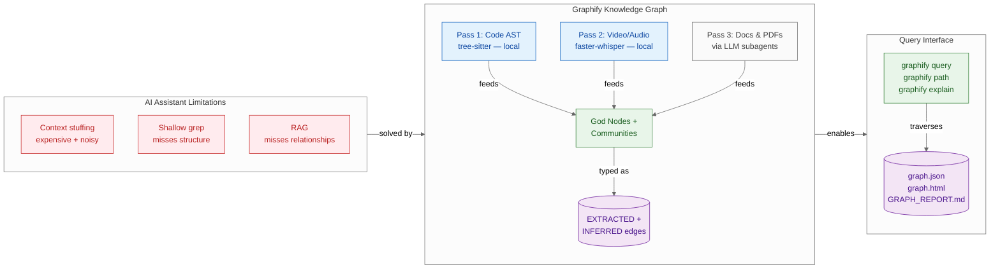

# Graphify — Summary

> AI coding assistants fail on large, mixed-media codebases because they lack structural knowledge — Graphify converts any repository (code + docs + SQL + PDFs + video) into a traversable knowledge graph, enabling precise structural queries without vector embeddings or token-stuffing.

**Sources analyzed:** [graphify-labs/graphify](https://github.com/graphify-labs/graphify) (README, ARCHITECTURE.md, docs/how-it-works.md, BENCHMARKS.md)
**Generated:** 2026-07-28

---

## Problem Statement

AI coding assistants face a structural knowledge problem when working with large codebases. The naive approach — stuffing entire repositories into a context window — is prohibitively expensive and produces noisy, unfocused results. The alternative, grepping raw files, is shallow: it finds text but cannot answer structural questions like "what calls this function across 40 files?" or "how does the auth module connect to the database layer?"

Retrieval-Augmented Generation (RAG) with vector stores partially addresses retrieval but introduces its own costs at ingest time and fundamentally encodes semantic similarity rather than structural relationships. A vector search cannot traverse a call graph, follow import chains, or explain why two modules are coupled. The result is that developers cannot ask relationship-oriented questions of their codebase without manually reading dozens of files.

The problem compounds in mixed-media repositories: source code, SQL schemas, architecture decision records (ADRs), PDFs, design documents, and video walkthroughs all contribute to understanding a system, but no single tool unifies them into one queryable representation. Each artifact type requires a different tool, and the connections between them go undiscovered.

## Solution at a Glance

Graphify converts a codebase — including its docs, SQL schemas, configs, and media — into a traversable knowledge graph (NetworkX) using deterministic local AST parsing for code and optional LLM subagents for unstructured content. The graph exposes three query modes (`query`, `path`, `explain`) and produces three output artifacts: an interactive browser visualization, a Markdown highlights report, and a JSON file that can be queried at any time without re-reading the repository.

---

## Part I: Conceptual Overview

### Purpose

Graphify exists to give AI coding assistants structural memory of a codebase. Where vector RAG answers "what is semantically similar to this?", Graphify answers "what is structurally connected to this, and why?" The driving philosophy is that code relationships — imports, calls, inheritance, SQL foreign keys, ADR citations — are deterministic and should be extracted deterministically, not guessed by an embedding model. The tool is explicitly local-first for code: no source file ever leaves the machine during the code-parsing phase.

A secondary purpose is to make the knowledge representation explicit and auditable. Every edge is tagged as either `EXTRACTED` (found explicitly in the source) or `INFERRED` (resolved by Graphify from context), with confidence scores from 0.55 (speculative) to 0.95 (near-certain). This distinguishes Graphify from black-box embedding approaches where it is impossible to know why two items were linked.

### Core Concepts

Key concepts in Graphify's vocabulary:

- **Knowledge Graph**: A NetworkX graph where nodes are code entities (functions, classes, SQL tables, doc sections, video segments) and edges are typed relationships (`calls`, `imports`, `inherits`, `uses`, `semantically_similar_to`, etc.).
- **God Nodes**: The most-connected nodes in the graph — the concepts that everything else flows through. These are surfaced prominently in the report and used to seed video transcription prompts, focusing local inference on the domain.
- **Communities**: Subgraphs of densely connected nodes detected by the Leiden algorithm. Each community represents a functional subsystem (e.g., "auth layer", "data pipeline"). Labels are generated without LLM calls — the graph structure itself encodes the clusters.
- **EXTRACTED edges**: Connections explicitly present in source (e.g., an `import` statement, a SQL `FOREIGN KEY`). Confidence 1.0 by definition.
- **INFERRED edges**: Connections resolved by Graphify from context and naming patterns, tagged with confidence 0.55–0.95. These represent the "why" that code alone doesn't make explicit.
- **Three-pass extraction**: Code is parsed locally (Pass 1, tree-sitter), audio/video transcribed locally (Pass 2, faster-whisper), and unstructured documents processed by LLM subagents (Pass 3). Only Pass 3 costs tokens.

### Strengths

**Token efficiency at scale.** On a representative corpus (Karpathy repos + papers + images), Graphify reduces per-query token consumption by 71.5×. On a real-world benchmark (ERPNext, ~1M LOC), key-fact coverage improved from 70.8% (grep + read) to 82.0% with Graphify, at roughly 140K tokens per query versus ~2.8M for context-stuffing the whole repo.

**Local-first privacy.** Source code is never sent to any external service. The tree-sitter parser is fully deterministic and offline. Video/audio is transcribed locally with faster-whisper. Only unstructured documents (Markdown, PDFs, images) are sent to a configured LLM backend — and that backend is user-chosen (Anthropic, OpenAI, Gemini, Ollama, Bedrock, Azure, or DeepSeek).

**Auditable edges.** The `EXTRACTED` / `INFERRED` + confidence system makes the graph inspectable. A developer can ask "why does Graphify think this edge exists?" and get a traceable answer, unlike embedding similarity.

**Broad ecosystem compatibility.** The `/graphify` skill integrates with 20+ AI coding assistants (Claude Code, Cursor, Codex, Gemini CLI, GitHub Copilot Chat, Aider, Devin, Kiro, and more) via a cross-framework Agent-Skills spec.

**Incremental rebuilds.** SHA-256 content hashing skips unchanged files on re-runs. A post-commit hook enables automatic graph updates with no developer action.

### Weaknesses

**Pass 3 costs LLM credits.** Processing Markdown, PDFs, and images requires an LLM backend. Large documentation-heavy repos can incur meaningful API costs on initial graph construction.

**Python-centric tooling.** The runtime requires Python 3.10+, and extras (PDF, video, Neo4j, etc.) must be installed separately. There is no native binary distribution. Teams with non-Python build environments face an additional dependency to manage.

**Early-stage project.** Graphify is a Y Combinator S26 company — the library is under active development on the `v8` branch. APIs, output formats, and module boundaries are subject to change. The benchmark methodology (especially LOCOMO and LongMemEval-S) is self-reported and not yet independently reproduced.

**Graph construction time.** For very large repositories, the parallel AST extraction provides ~1.66× speedup over sequential, but a 1M-LOC codebase still requires a non-trivial upfront build. The cache helps on subsequent runs but not the first.

### Tradeoffs

- **Structural precision vs. semantic flexibility**: Graph traversal finds exact structural paths (e.g., 3-hop shortest path from `FastAPI` to `ModelField`); vector RAG finds conceptually similar content. Graphify is better for "how does X connect to Y?" and worse for "what is similar to this concept?"
- **Local privacy vs. unstructured-doc coverage**: Keeping code local is a hard guarantee; getting full coverage of docs, PDFs, and images requires sending them to an LLM — users must choose which documents to include in Pass 3.
- **Determinism vs. richness**: Tree-sitter parsing is 100% deterministic and free; LLM-based extraction of doc relationships is richer but non-deterministic and costs tokens.
- **Upfront build cost vs. query-time savings**: The first `graphify build` is expensive in time (and credits for Pass 3). Every subsequent query amortizes that cost — the graph.json is reused indefinitely until files change.

### Costs & Caveats

**Prerequisites**: Python 3.10+, `pip install graphifyy` (note the double-y). Feature extras (`pdf`, `video`, `mcp`, `neo4j`, etc.) require separate installs. An LLM API key is needed for Pass 3 (docs/PDFs); code-only repos can run entirely without one.

**Benchmark caveats**: The 71.5× token reduction figure comes from a specific corpus (4 repos + papers + images); a pure-code repo with no docs yields only ~5.4× reduction. The LOCOMO benchmark result (45.3% QA accuracy) is competitive but not best-in-class — the `supermemory` baseline achieves 49.7%, though at 11× the ingest cost.

**graph.json merge conflicts**: In multi-developer workflows, `graph.json` will create git conflicts. The repo ships a union merge driver for `graph.json`, but teams must configure it.

**No telemetry by default**, but query logging can be enabled via environment variable — worth confirming this is off in regulated environments.

---

## Part II: Technical & Architectural Overview

> *Included because the source specifies implementation details.*

### Architecture Overview

Graphify is a linear, stateless extraction pipeline. Each stage is a single function in its own module, communicating through plain Python dicts and NetworkX graph objects — no shared state, no side effects outside the `graphify-out/` output directory.

```mermaid
%%{init: {'theme': 'neutral'}}%%
flowchart LR
    classDef processCls  fill:#e3f2fd,stroke:#1565c0,color:#0d47a1
    classDef solutionCls fill:#e8f5e9,stroke:#2e7d32,color:#1b5e20
    classDef dataCls     fill:#f3e5f5,stroke:#6a1b9a,color:#4a148c
    classDef externalCls fill:#fafafa,stroke:#757575,color:#424242

    subgraph Passes["Three Extraction Passes"]
        direction TD
        EP1["Pass 1: tree-sitter AST\n~40 languages — local"]:::processCls
        EP2["Pass 2: faster-whisper\nvideo/audio — local"]:::processCls
        EP3["Pass 3: LLM subagents\ndocs/PDFs/images"]:::externalCls
    end

    D["detect.py"]:::processCls
    E["extract.py"]:::processCls
    BG["build.py"]:::processCls
    CL["cluster.py\nLeiden"]:::processCls
    AN["analyze.py"]:::processCls
    RP["report.py"]:::processCls
    EX["export.py"]:::processCls

    subgraph Outputs["Artifacts"]
        direction TD
        O1[("graph.json")]:::dataCls
        O2["graph.html"]:::solutionCls
        O3["GRAPH_REPORT.md"]:::solutionCls
    end

    D -- "filtered files" --> E
    Passes -- "extraction methods" --> E
    E -- "nodes + edges dicts" --> BG
    BG -- "nx.Graph" --> CL
    CL -- "with communities" --> AN
    AN -- "analysis dict" --> RP
    RP -- "report string" --> EX
    EX -- "writes" --> Outputs
```

### Key Components

| Module | Function | Role |
|---|---|---|
| `detect.py` | `collect_files(root)` | Walks the directory tree; applies ignore rules; returns a filtered `[Path]` list |
| `extract.py` | `extract(path)` | Dispatches to the appropriate extractor by file type; returns `{nodes, edges}` dict |
| `build.py` | `build_graph(extractions)` | Merges all extraction dicts into a single `nx.Graph`; deduplicates nodes; resolves cross-file edges |
| `cluster.py` | `cluster(G)` | Runs Leiden community detection; annotates each node with a `community` attribute |
| `analyze.py` | `analyze(G)` | Identifies god nodes (by degree centrality), surprising connections, and suggested questions |
| `report.py` | `render_report(G, analysis)` | Renders the human-readable `GRAPH_REPORT.md` string from graph + analysis |
| `export.py` | `export(G, out_dir, ...)` | Writes `graph.json`, `graph.html`, `graph.svg`, and optional Obsidian vault |
| `cache.py` | `check/save_semantic_cache` | SHA-256 fingerprints files; splits into (cached, uncached) on re-runs |
| `security.py` | validation helpers | Validates URLs, sanitizes node labels, enforces `graphify-out/` path boundaries |
| `serve.py` | `start_server(graph_path)` | Launches an MCP stdio server exposing the graph as structured tools |
| `ingest.py` | `ingest(url, ...)` | Fetches a URL and saves content to the corpus directory for Pass 3 processing |

### Technology Choices

| Technology | Role | Mandated? |
|---|---|---|
| Python 3.10+ | Runtime | Required |
| [tree-sitter](https://tree-sitter.github.io/tree-sitter/) | Deterministic AST parsing for ~40 languages | Required for code extraction |
| [NetworkX](https://networkx.org/) | Graph data structure and traversal | Required |
| [Leiden algorithm](https://www.nature.com/articles/s41598-019-41695-z) | Community detection | Optional (`graphifyy[leiden]`) |
| [faster-whisper](https://github.com/SYSTRAN/faster-whisper) | Local video/audio transcription | Optional (`graphifyy[video]`) |
| ProcessPoolExecutor | Parallel code file extraction (bypasses GIL) | Built-in |
| Neo4j / FalkorDB | External graph database push | Optional extras |
| MCP stdio/HTTP | Graph exposure as structured tools | Optional (`graphifyy[mcp]`) |
| LLM backend (any) | Pass 3 doc/PDF/image extraction | Optional; user-configured |

The LLM backend is deliberately abstracted — Anthropic Claude, OpenAI, Gemini, Ollama (local), DeepSeek, AWS Bedrock, and Azure OpenAI are all supported via separate extras. This means Graphify can run 100% offline for code-only repositories using tree-sitter + Leiden + Ollama.

### Data Flows

**Pass 1 — Code structure (free, offline)**
`detect.py` collects all code files. `extract.py` dispatches each to a tree-sitter grammar for the detected language. The grammar produces a structured AST from which classes, functions, imports, call relationships, SQL tables, foreign keys, and inline `# NOTE:` / `# WHY:` comments are extracted as nodes and edges. Code files are processed in parallel via `ProcessPoolExecutor`, yielding ~1.66× speedup on an 84-file corpus. Results are cached by SHA-256 hash.

**Pass 2 — Video/audio (free, offline)**
Video and audio files are transcribed locally by faster-whisper. Before transcription, the current "god nodes" from Pass 1 are injected into the transcription prompt to focus the model on domain-relevant terminology. Transcript segments become nodes linked to the concepts they discuss.

**Pass 3 — Docs, PDFs, images (costs LLM tokens)**
Remaining files (Markdown, PDFs, images, transcripts) are batched and dispatched as parallel LLM subagents. Each subagent reads a batch and outputs a JSON fragment (`{nodes, edges}`) that is merged into the main graph. This is the only phase that communicates with an external service.

**Graph assembly and community detection**
`build.py` merges all extraction fragments, deduplicates nodes (by ID), and resolves cross-file references into edges. `cluster.py` runs the Leiden algorithm directly on the NetworkX graph — no embeddings needed, because `semantically_similar_to` edges from Pass 3 already encode similarity in graph structure. Community labels are assigned without additional LLM calls.

**Querying**
The assembled `graph.json` supports three query modes at any time: `query` (plain-language search returning relevant subgraph), `path` (shortest structural path between two named nodes), and `explain` (all edges incident to a named node). The MCP server exposes the same capabilities as structured tools for AI assistant integration.

---

## External References

- [tree-sitter](https://tree-sitter.github.io/tree-sitter/) — Deterministic incremental AST parser supporting ~40 languages; used for all code extraction
- [NetworkX](https://networkx.org/) — Python graph library providing the underlying data structure and traversal algorithms
- [Leiden algorithm paper](https://www.nature.com/articles/s41598-019-41695-z) — "From Louvain to Leiden: guaranteeing well-connected communities" — the community detection method used in `cluster.py`
- [faster-whisper](https://github.com/SYSTRAN/faster-whisper) — CTranslate2-based reimplementation of Whisper for local video/audio transcription
- [Agent-Skills spec](https://github.com/anthropics/skills) — Anthropic's cross-framework skill spec that Graphify uses for AI assistant integration
- [ERPNext](https://github.com/frappe/erpnext) — ~1M LOC benchmark corpus used to measure code intelligence improvement
- [LOCOMO benchmark](https://arxiv.org/abs/2406.09003) — Conversational memory QA benchmark (n=300) used to compare Graphify against RAG baselines
- [LongMemEval-S benchmark](https://arxiv.org/abs/2410.10813) — Long-term memory evaluation benchmark (n=50)
- [PyPI: graphifyy](https://pypi.org/project/graphifyy/) — Published package (note the double-y)
- [uv](https://docs.astral.sh/uv/) — Fast Python package manager used in the Graphify dev toolchain
- [Graphify website](https://graphify.com) — Project homepage
- [Graphify Discord](https://discord.gg/598Ad9zQZ) — Community support
- [The Memory Layer (book)](https://safishamsi.gumroad.com/l/qetvlo) — Author's companion book on knowledge graph approaches to AI memory

---

## Source Material

- [graphify-labs/graphify — README](https://github.com/graphify-labs/graphify)
- [graphify-labs/graphify — ARCHITECTURE.md](https://github.com/graphify-labs/graphify/blob/v8/ARCHITECTURE.md)
- [graphify-labs/graphify — docs/how-it-works.md](https://github.com/graphify-labs/graphify/blob/v8/docs/how-it-works.md)
- [graphify-labs/graphify — BENCHMARKS.md](https://github.com/graphify-labs/graphify/blob/v8/BENCHMARKS.md)

---

## Key Takeaways

- **The graph replaces the index, not the model.** Graphify does not replace your LLM — it gives it a structured representation of codebase relationships to traverse, rather than forcing it to rediscover structure from raw tokens every query.
- **Code extraction is truly free and private.** tree-sitter parsing is deterministic, local, and costs zero tokens. Only unstructured documents (Markdown, PDFs, images) require an LLM backend — and that can be a local Ollama model.
- **71.5× token reduction is real but corpus-dependent.** The headline figure applies to doc-heavy repos; pure-code repos see ~5.4× reduction. The benefit scales with how much unstructured documentation exists alongside the code.
- **EXTRACTED vs. INFERRED is the key audit mechanism.** Every edge being typed and confidence-scored is what makes Graphify debuggable when an AI assistant gives a surprising answer about your codebase.
- **Adoption requires a mindset shift.** Teams need to run `graphify build` before querying (upfront cost), configure a merge driver for `graph.json`, and decide which documents to include in Pass 3. The payoff is query-time savings that compound across every subsequent AI-assisted task.

---

## Conclusion

Graphify is an emerging, early-stage tool (YC S26, active `v8` branch) that addresses a real and underserved problem: giving AI coding assistants durable structural knowledge of large codebases without vector embeddings or context-stuffing. Its core insight — that code relationships are deterministic and should be extracted deterministically — is technically sound, and the local-first privacy guarantee for source code is a meaningful differentiator. The primary adoption caveat is the upfront build investment and the dependency on an LLM backend for unstructured documents; teams with large, pure-code repositories and minimal documentation will see the smallest benefit, while teams with rich documentation, ADRs, SQL schemas, and video walkthroughs stand to gain the most.
