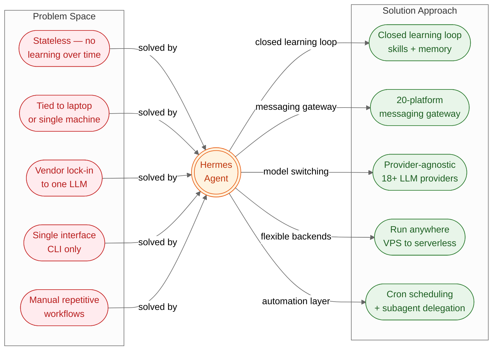
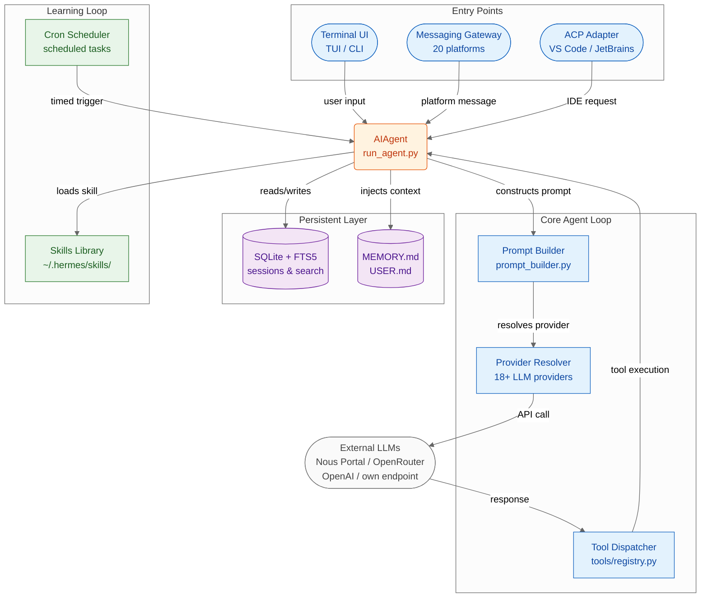

# Hermes Agent — Summary

> AI agents forget everything between sessions and are tied to one machine — Hermes adds a closed learning loop, persistent memory, and multi-platform deployment so the agent grows with you.

**Sources analyzed:** [Hermes Agent README](https://github.com/nousresearch/hermes-agent?tab=readme-ov-file) · [Architecture Docs](https://hermes-agent.nousresearch.com/docs/developer-guide/architecture) · [Skills System Docs](https://hermes-agent.nousresearch.com/docs/user-guide/features/skills) · [Memory System Docs](https://hermes-agent.nousresearch.com/docs/user-guide/features/memory)
**Generated:** 2026-07-28

---

## Problem Statement

Most AI agents are ephemeral: every new session starts with a blank slate. Even sophisticated assistants like Claude Code, Cursor, or GPT-4o have no mechanism to remember what worked last Tuesday, what the user's preferences are, or what procedures a team has collectively refined over weeks of use. Each conversation resets the loop, leaving users to re-explain context, re-discover workarounds, and manually transfer hard-won knowledge.

The deployment model compounds the problem. Running an agent locally means it stops working when the laptop sleeps, the VPN drops, or the developer switches machines. Messaging from a mobile device while the agent works on a server — a natural desire for any hands-off automation — is either impossible or requires building custom infrastructure. This creates a practical ceiling on unattended, long-horizon agent tasks.

Provider lock-in is a third constraint. Most agent frameworks couple their session and memory management tightly to a single LLM provider's API. Switching models — say, from OpenAI to an Anthropic endpoint or a self-hosted model — requires code changes, often touching prompt formatting, tool schema serialization, and credential management. Experimentation is expensive.

Finally, automation without scheduling is manual: users must be present to trigger each agent run. Without first-class cron support, agents cannot perform nightly backups, daily reports, or periodic audits without external orchestration glue.

## Solution at a Glance

Hermes Agent is a self-improving, platform-agnostic AI agent runtime built by Nous Research. Its defining feature is a closed learning loop: after completing complex tasks, the agent autonomously creates "skills" — structured, reusable knowledge documents — and maintains persistent memory files that inject prior knowledge into every subsequent session. A unified messaging gateway serves 20 platforms (Telegram, Discord, Slack, WhatsApp, Signal, and more) from a single process, and six terminal backends let the agent run anywhere from a local machine to serverless cloud infrastructure. All LLM providers are treated uniformly; switching requires one command.

---

## Part I: Conceptual Overview

### Purpose

Hermes exists to close the feedback loop that most agents leave open. The dominant model is: user asks, agent answers, session ends, knowledge evaporates. Hermes treats each completed task as raw material for permanent capability: skills are written, memories are updated, user profiles are deepened. The design philosophy is that an agent should become measurably more useful the longer it runs — not through fine-tuning, but through accumulated procedural knowledge that loads selectively into context.

A secondary purpose is infrastructure independence. Hermes is built to run on whatever compute is cheapest or most convenient: a $5 VPS for always-on availability, Modal or Daytona for serverless hibernation, a GPU cluster for inference-heavy workloads, or a laptop for quick experiments. The gateway layer means the user can interact from any device or messaging app while computation happens elsewhere.

### Core Concepts

The solution introduces a small vocabulary of interconnected concepts:

- **Skills**: Structured YAML + Markdown documents that encode procedural knowledge. They live in `~/.hermes/skills/`, follow the agentskills.io open standard, and are loaded on demand to minimize token cost. Skills are created autonomously by the agent after complex tasks, can be patched during use, and self-improve via background review.
- **Memory**: Two character-limited files — `MEMORY.md` (2,200 chars) and `USER.md` (1,375 chars) — injected into the system prompt as a frozen snapshot at session start. The tight limits force active consolidation rather than accumulation.
- **Learning Loop**: The cycle of task execution → skill creation → memory update → user profile deepening → richer context in the next session. Background review processes run on auxiliary models to propose updates without blocking the main conversation.
- **Messaging Gateway**: A long-running process that bridges 20 platform adapters to a single `AIAgent` instance. Each platform message routes through authorization, session resolution, and delivery back to the originating platform.
- **Terminal Backends**: Six execution environments (local, Docker, SSH, Singularity, Modal, Daytona) that the agent can target for shell command execution, enabling cloud-resident operation.
- **Provider Resolution**: A shared resolver that maps `(provider, model)` pairs to API credentials across 18+ providers, used uniformly by CLI, gateway, cron, and ACP interfaces.

### Strengths

- **Genuine learning**: The skills system creates a compounding knowledge base that gets more useful over time without any model retraining. Skill creation triggers automatically after complex multi-step tasks.
- **Platform reach**: A single `hermes gateway start` command makes the agent reachable from Telegram, Discord, Slack, WhatsApp, Signal, Matrix, email, and SMS — enabling mobile-first use while compute runs server-side.
- **Provider flexibility**: Switching LLM providers requires no code changes; a single `hermes model` command or `/model` slash command handles it. The same provider-agnostic interface covers 18+ providers.
- **Serverless friendliness**: Modal and Daytona backends let the agent hibernate between uses, making always-on infrastructure cost nearly nothing when idle.
- **Research tooling**: Batch trajectory generation and trajectory compression for training data support academic and fine-tuning workflows that most agent frameworks do not consider.
- **Ecosystem interoperability**: Compliance with the agentskills.io standard means skills created in Hermes can be shared across agent platforms.

### Weaknesses

- **Memory limits are tight**: The 2,200-character `MEMORY.md` and 1,375-character `USER.md` hard caps mean the agent must actively cull old information. Nuanced, long-form context is routinely lost.
- **Skill quality is unguarded by default**: Autonomous skill creation can produce low-quality or redundant skills. The write-approval gate mitigates this but is opt-in; many users will leave it disabled.
- **Gateway complexity**: Running the messaging gateway is a separate long-running process with its own auth model (allowlists, DM pairing). For users who just want a CLI agent, this is dead weight.
- **Young project**: The repo was created in July 2025. Native Windows support and Termux compatibility are documented as having rough edges.
- **No native mobile app**: Cross-platform reach depends on third-party messaging apps as intermediaries, not a purpose-built mobile client.

### Tradeoffs

- **Tight memory caps → forced consolidation vs. rich context**: Keeping memory small ensures fast prompt assembly and cheap tokens, but sacrifices depth. Users who need rich per-project context must encode it in skills or context files instead.
- **Agent-authored skills → automation vs. control**: Letting the agent write its own skills reduces user burden but creates drift risk — the agent may encode bad patterns and self-reinforce them. Write-approval restores control at the cost of friction.
- **Provider agnosticism → flexibility vs. optimization**: The uniform provider interface means provider-specific features (Anthropic extended thinking, OpenAI o1 reasoning tokens) are not surfaced without custom work.
- **Serverless backends → low idle cost vs. cold-start latency**: Modal and Daytona hibernation means pay-per-use pricing, but cold starts add latency to the first message after an idle period.

### Costs & Caveats

Adoption requires assembling several dependencies: Python 3.11, Node.js, ripgrep, ffmpeg, and uv. The installer handles this automatically on Linux/macOS/WSL2 and PowerShell, but Termux requires a manual path documented separately.

The messaging gateway introduces a second operational surface: users must manage allowlists, DM pairing codes, and platform bot credentials (Telegram bot tokens, Discord app IDs, etc.) independently of the core agent config. Misconfigured allowlists expose the agent to anyone who can message the bot.

Skill write-approval is disabled by default. Without it, the agent autonomously modifies its own procedural knowledge — powerful, but creating a long-tail risk of compounding bad patterns over time.

The Honcho integration for dialectic user modeling is one of eight external memory provider plugins. Its behavior and data retention policies are governed by Honcho's own infrastructure, not Hermes.

---

## Part II: Technical & Architectural Overview

> *Included because the source specifies implementation details.*

### Architecture Overview

Hermes is a Python monolith organized around a single `AIAgent` class (`run_agent.py`) that serves three entry points: a terminal UI (`cli.py`), a messaging gateway (`gateway/run.py`), and an ACP adapter for IDE integrations (`acp_adapter/`). All three entry points share the same agent loop, provider resolver, and tool registry. Session state is persisted in SQLite with FTS5 full-text indexing at `~/.hermes/state.db`.

The prompt assembly pipeline uses an ordered tier system — stable (identity + tool guidance), context (tool definitions + skill content), volatile (memory blocks + user profile + timestamps) — with Anthropic cache breakpoints applied for prefix caching where supported. Context compression automatically summarizes conversation turns when token thresholds are exceeded.

### Key Components

**`AIAgent` (`run_agent.py`)** — The central orchestrator. Manages the conversation loop, retry logic, fallback handling, and callback-based progress reporting. Supports synchronous execution and mid-flight cancellation of both API calls and tool runs.

**`prompt_builder.py`** — Assembles the system prompt in three ordered tiers (stable → context → volatile). Applies Anthropic cache breakpoints for token-efficient prefix caching. Triggers automatic context compression when token thresholds are exceeded.

**`tools/registry.py`** — Central registry for 70+ tools across ~28 toolsets. Tools self-register at import time. Key categories: 6 terminal backends, 10 browser automation tools, file operations, web search/extraction, MCP integration, vision, and subagent delegation.

**`gateway/run.py`** — A long-running process implementing 20 platform adapters. Handles unified session routing, user authorization (allowlists + DM pairing), a hook system for extensibility, cron job ticking, and background maintenance tasks.

**`cron/`** — A first-class scheduler storing jobs in JSON. Jobs support multiple schedule formats, attach skills or scripts, and deliver results to any gateway-connected platform. Scheduled agent instances are fresh `AIAgent` objects with skill injection.

**`plugins/`** — Extensibility layer with three discovery sources: user plugins (`~/.hermes/plugins/`), project plugins (`.hermes/plugins/`), and pip entry points. Two specialized plugin types exist — memory providers and context engines — each single-select.

**SQLite + FTS5 (`~/.hermes/state.db`)** — Persistent session storage with full-text indexing, conversation lineage tracking (parent/child across compressions), per-platform isolation, and atomic writes.

### Technology Choices

| Technology | Role | Mandatory? |
|---|---|---|
| Python 3.11 | Core runtime | Yes |
| uv | Python package manager (Rust-based, bundled) | Yes (installer) |
| Node.js | Gateway and certain tool integrations | Yes |
| SQLite + FTS5 | Session persistence and full-text search | Yes |
| ripgrep | Fast file search for file-search toolsets | Yes |
| ffmpeg | Audio/video processing for voice memo transcription | Yes |
| Modal / Daytona | Serverless execution backends | Optional |
| Honcho | Dialectic user modeling memory provider | Optional plugin |
| agentskills.io standard | Skill format for cross-platform interoperability | Yes (format) |

### Data Flows

**CLI session**: User types → prompt builder constructs tiered system prompt → provider resolver maps `(provider, model)` to API credentials → LLM API call → tool dispatcher executes tool calls in a loop → response streams to terminal → session and memory written to SQLite.

**Gateway message**: Platform event (e.g., Telegram message) → adapter normalizes to internal message format → authorization check (allowlist/DM pairing) → session resolved from SQLite → `AIAgent` executes → response delivered back to originating platform.

**Cron job**: Scheduler tick at configured interval → job loaded from JSON → fresh `AIAgent` created → skill injected into prompt → task executed → result delivered to configured gateway platform.

**Skill creation (learning loop)**: Task completes with 5+ tool calls → agent calls `skill_manage` tool to write a new SKILL.md → skill stored in `~/.hermes/skills/` → background review (auxiliary model) evaluates and may propose patches → if write-approval is enabled, staged for human review; otherwise applied immediately.

---

## External References

- [Nous Research](https://nousresearch.com) — builder of Hermes Agent; AI safety and capabilities research lab
- [Nous Portal](https://portal.nousresearch.com) — subscription service providing 300+ models + Tool Gateway (web search, image gen, TTS, cloud browser) under one plan
- [Honcho](https://github.com/plastic-labs/honcho) — dialectic user modeling library; optional memory provider plugin for Hermes
- [agentskills.io](https://agentskills.io) — open standard for agent skill interoperability that Hermes skills comply with
- [Firecrawl](https://firecrawl.dev) — web search/extraction tool routed through Nous Portal Tool Gateway
- [FAL](https://fal.ai) — image generation service routed through Nous Portal Tool Gateway
- [Modal](https://modal.com) — serverless Python cloud; one of Hermes' six terminal backends for hibernating agent execution
- [Daytona](https://daytona.io) — cloud development environments; serverless backend with workspace persistence
- [uv](https://astral.sh/uv) — Rust-based Python package manager bundled in the Hermes installer
- [computer-use-linux](https://github.com/avifenesh/computer-use-linux) — community Linux desktop-control MCP server compatible with Hermes
- [HermesClaw](https://github.com/AaronWong1999/hermesclaw) — community WeChat bridge for Hermes Agent

---

## Source Material

- [Hermes Agent README](https://github.com/nousresearch/hermes-agent?tab=readme-ov-file)
- [Architecture Documentation](https://hermes-agent.nousresearch.com/docs/developer-guide/architecture)
- [Skills System Documentation](https://hermes-agent.nousresearch.com/docs/user-guide/features/skills)
- [Memory System Documentation](https://hermes-agent.nousresearch.com/docs/user-guide/features/memory)

---

## Key Takeaways

- **Learning is the differentiator**: Hermes's closed learning loop — autonomous skill creation + persistent memory — is the feature that most distinguishes it from stateless agent wrappers. Skills compound over time in a way that prompt engineering alone cannot match.
- **Deployment flexibility is a first-class concern**: The six terminal backends and serverless support are not an afterthought — they are the mechanism that makes "always-on, not laptop-tied" actually achievable without running a full VM 24/7.
- **Tight memory limits enforce discipline**: The character caps on `MEMORY.md` and `USER.md` look like a weakness but are a deliberate design constraint that forces active curation rather than passive accumulation, keeping token budgets predictable.
- **Provider agnosticism is structural, not superficial**: All three entry points (CLI, gateway, ACP) share the same provider resolver, so switching providers is a config change, not a code change — making Hermes model-ecosystem-proof as the LLM landscape evolves.
- **Write-approval gating is the key safety lever**: Users who care about skill quality should enable `skills.write_approval` — it is the only guardrail against the agent encoding bad patterns into its own persistent procedural memory.

---

## Conclusion

Hermes Agent is an emerging, rapidly adopted open-source framework (221k GitHub stars, repo created July 2025) that addresses a genuine gap: AI agents that accumulate knowledge rather than resetting each session. It is best suited for power users, developers, and teams who want a persistent AI presence accessible from mobile and messaging apps, running unattended on cloud infrastructure, and growing more useful over time. The most important caveat is maturity: the project is under one year old, native Windows and Termux support have documented rough edges, and the autonomous skill-writing capability requires active governance (write-approval gating) to prevent quality drift.
