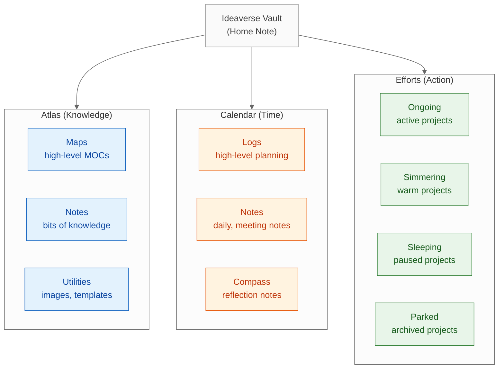

# Ideaverse for Obsidian — ACE Folder Framework — Summary

> The ACE framework (Atlas, Calendar, Efforts) organizes an Obsidian vault around three natural human thinking modes — Knowledge, Time, and Action — enabling deliberate context switching and an evolving folder structure that grows with the user.

**Sources analyzed:** [Create Your Digital Home: Obsidian Walkthrough](https://www.youtube.com/watch?v=bVl3IRGOWvk) by Nick Milo (Linking Your Thinking)
**Generated:** 2026-07-28

---

## Problem Statement

Most personal knowledge management (PKM) systems force users into one of two extremes: rigid folder hierarchies that feel like filing cabinets, or a flat link-only graph that becomes navigable only by power users. Neither approach acknowledges that human thinking naturally operates across three distinct modes — understanding new knowledge, tracking time-based events, and executing projects — and that people shift between these modes constantly throughout a day, week, or lifetime.

A second concrete failure is that beginners copy expert systems before earning their structure. Someone who has been using Obsidian for three years has subfolders, tags, and maps of content born from real friction. A beginner who imports that system immediately is overwhelmed and abandons it, or cargo-cults structure that doesn't fit their actual workflow.

Third, context switching between mental modes is cognitively expensive. Without a consistent spatial metaphor for where to go when shifting from "learning mode" to "doing mode," users burn mental energy deciding where a note lives each time they create one — the equivalent of re-organizing a desk before every task.

## Solution at a Glance

The ACE framework — Atlas (Knowledge), Calendar (Time), Efforts (Action) — gives an Obsidian vault three top-level folders that correspond directly to the three headspaces humans already use naturally. Notes are placed by their temporal and cognitive context rather than by topic alone, reducing the decision load of "where does this go?" to a single question: am I dealing with knowledge, time, or action right now? The system deliberately starts simple (three folders for beginners) and earns complexity over time as the user's needs reveal themselves.

---

## Part I: Conceptual Overview

### Purpose

ACE exists to make the invisible visible. The three headspaces — Knowledge, Time, and Action — have always been how humans orient their thinking, but digital tools obscure them. By surfacing these headspaces as named folders, ACE lets users consciously navigate their own thinking rather than reacting to wherever a search result or recency sort happens to land them.

The deeper philosophy, as Nick Milo articulates it, is that folders and links are not in opposition. Folders provide spatial orientation; links provide conceptual connection. ACE unifies both under a single mental model by giving the folder structure a cognitive rationale rather than a topical one.

### Core Concepts

**Headspaces** are the three modes of cognition ACE is built around:
- **Knowledge** — the orientation toward understanding: absorbing, synthesizing, sense-making
- **Time** — the orientation toward temporal context: present, past, future; focus and reflection
- **Action** — the orientation toward doing: projects, outcomes, execution

**ACE** maps each headspace to a named folder:
- **Atlas** → Knowledge headspace; intention is to understand; guiding question is "Where would I like to go?"
- **Calendar** → Time headspace; intention is to focus; covers daily notes, meeting notes, journals, planning
- **Efforts** → Action headspace; intention is to act; covers projects in all stages of intensity

**The Pendulum** is Nick Milo's metaphor for the natural oscillation between headspaces. No one lives permanently in one mode. A researcher absorbing new information (Atlas) eventually hits a deadline and moves into Efforts. A project worker who finishes an intense sprint may feel overwhelmed and retreats to Calendar to reflect. The pendulum swings hourly, daily, or yearly — ACE gives each landing spot a clear address.

**Earn Your Structure** is the principle that folder complexity should emerge from genuine need, not be copied from someone else's mature system. Beginners start with three folders; Navigators add subfolders they've discovered they need; Zen Masters may strip back down to near-nothing, relying on links.

**Maps of Content (MOC)** are high-level notes that serve as navigational hubs inside the Atlas folder, aggregating links to related micro-notes.

```mermaid
%%{init: {'theme': 'neutral'}}%%
graph LR
    classDef atlasCls fill:#e3f2fd,stroke:#1565c0,color:#0d47a1
    classDef calendarCls fill:#fff3e0,stroke:#e65100,color:#bf360c
    classDef effortsCls fill:#e8f5e9,stroke:#2e7d32,color:#1b5e20

    subgraph Ideaverse["Ideaverse — Obsidian Vault"]
        Atlas("Atlas\nKnowledge · Understand"):::atlasCls
        Calendar("Calendar\nTime · Focus"):::calendarCls
        Efforts("Efforts\nAction · Act"):::effortsCls

        Atlas -- "deadline or deliverable" --> Efforts
        Efforts -- "new interest to learn" --> Atlas
        Efforts -- "overwhelmed, need to reflect" --> Calendar
        Calendar -- "clarity on next steps" --> Efforts
        Atlas -- "meeting notes, time-based" --> Calendar
        Calendar -- "synthesize notes" --> Atlas
    end
```

### Strengths

**Cognitively grounded.** The three headspaces are not invented — they map to how humans already think. The framework succeeds because it names reality rather than imposing a new taxonomy.

**Scales with the user.** A beginner with three folders and a Zen Master with three folders are both correctly using ACE. The system doesn't break under simplification; it just compresses.

**Reduces placement decisions.** The headspace question ("am I in Knowledge, Time, or Action mode right now?") is faster to answer than topical questions ("does this note go in Philosophy, Psychology, or Self-Improvement?").

**Context-switch aware.** By naming distinct headspaces, ACE helps users batch similar-mode work together, reducing the cognitive cost of context switching. Knowing you're "in Atlas mode" for the afternoon is itself clarifying.

**Unifies folders and links.** ACE gives folders a semantic purpose, which means links across folders now carry cross-headspace meaning rather than just cross-topic meaning.

### Weaknesses

**Folder-first presentation.** The framework is often framed primarily as a folder system, which undersells its deeper purpose as a headspace model. Users who try to apply it purely as a filing scheme may miss the mindset shift.

**Efforts taxonomy underspecified.** The four intensities of Efforts (Ongoing, Simmering, Sleeping, Parked) are teased but deferred to a future lesson. This leaves the most action-oriented part of the system partially defined in introductory content.

**No cross-cutting concern guidance.** Some notes — like a reference article that is also time-stamped — genuinely span headspaces. ACE doesn't explicitly handle this placement ambiguity.

**Requires metacognitive awareness.** The pendulum metaphor only works if the user can accurately identify which headspace they're currently in. For people who struggle with this self-observation, placement decisions may remain difficult.

### Tradeoffs

| You gain | You give up |
|---|---|
| Spatial clarity: each folder has a cognitive rationale | Topical grouping: notes on the same subject may spread across Atlas and Efforts |
| Permission to start simple | The comfort of having an "everything" folder that captures all contexts |
| A framework that grows with you | A stable structure from day one |
| Conscious context switching | Frictionless capture without placement decisions |

### Costs & Caveats

The system requires a one-time mindset shift: the user must accept that folder placement is driven by cognitive context, not subject matter. For users deeply habituated to topic-based filing (discipline by folder), this reframing takes deliberate practice.

The "earn your structure" principle means beginners will initially under-organize and may feel uncertain about whether their vault is correct. There is no objective correctness signal until friction reveals itself.

Obsidian is the demonstrated tool but ACE is tool-agnostic in principle — the video implicitly assumes Obsidian's bidirectional linking, graph view, and note-linking paradigm are in use.

---

## Part II: Technical & Architectural Overview

> *Included because the source specifies implementation details: named folders, subfolders, and structural patterns for three user levels.*

### Architecture Overview

The Ideaverse vault is an Obsidian folder with three top-level directories (Atlas, Calendar, Efforts) corresponding to the three headspaces. Within each, a two-tier structure separates high-level navigational notes ("Maps") from micro-notes ("Notes"), plus a Utilities folder for supporting assets. The pattern is fractal: Maps/Notes/Utilities appears in Atlas; Logs/Notes/Compass appears in Calendar; four intensity folders appear in Efforts.

A "Home Note" sits at the vault root and acts as a master navigation hub — pinned, always-accessible, linking out to the three headspace folders and their key Maps.

### Key Components

**Home Note** — The vault's root navigation hub, always pinned in a tab. Links to each headspace's top-level Map. Functions as an orientation anchor when the user re-enters the vault after a break.

**Atlas / Maps** — High-level notes (Maps of Content) that aggregate links to related micro-notes. Examples: "Ideaverse Map," subject-specific MOCs. These are the navigational skeleton of the knowledge headspace.

**Atlas / Notes** — Atomic knowledge notes. In a Navigator-level vault, these are subdivided into topic subfolders (e.g., Sources, People) as the user discovers genuine grouping needs.

**Calendar / Logs** — High-level time-based notes: annual reviews, monthly reviews, weekly plans. The "macro" layer of the time headspace.

**Calendar / Notes** — Micro time-based notes: daily notes, meeting notes. Raw capture before synthesis.

**Calendar / Compass** — Planning and reflection notes; high-level life-orientation documents. Optional; Navigator-level and above.

**Efforts (four intensities)** — Projects organized by energy investment rather than binary status:
- **Ongoing** — active, receiving regular attention
- **Simmering** — warm, checking in occasionally
- **Sleeping** — paused, may resume
- **Parked** — archived, not abandoned

### Technology Choices

**Obsidian** — The note-taking application demonstrated. Required features: folder pane, bidirectional links, pinned tabs, note navigation (back button). The Ideaverse template is delivered as a pre-configured Obsidian vault.

**Markdown files** — All notes are plain-text `.md` files, ensuring portability and longevity.

**Obsidian's link system** — `[[wikilinks]]` provide cross-headspace connective tissue. A meeting note in Calendar can link to a people note in Atlas; an Effort note can link to its corresponding knowledge Maps.

**STIR framework** — Referenced but not detailed in this lesson; governs organizing principles within folders. Linked from the ACE Folder Framework note for independent study.

**ARC framework** — Teased for the next lesson; described as a workflow and major part of the Ideaverse Workshop. Relates to how the Home Note is used day-to-day.

### Data Flows

Notes move through the vault in two patterns:

1. **Capture → Headspace → Synthesis:** A meeting note lands in Calendar/Notes (time-based capture). The user synthesizes key insights into an Atlas note (knowledge extraction). An action item from the meeting becomes an Efforts note (action extraction).

2. **Headspace switching:** As the user's context shifts (new interest → Atlas, deadline → Efforts, overwhelm → Calendar), they navigate to the corresponding headspace folder and work from there. The Home Note is the re-entry point when returning after any break.

---

## External References

- [Obsidian](https://obsidian.md) — the Markdown-based note-taking app used to host the Ideaverse vault
- [Linking Your Thinking (LYT)](https://www.youtube.com/@linkingyourthinking) — Nick Milo's YouTube channel and methodology hub
- [Maps of Content (MOC)](https://publish.obsidian.md/lyt-kit) — high-level navigational notes; a core LYT concept used within Atlas
- STIR framework — organizing-principles system referenced in the ACE Folder Framework note; deep-dive link shown in video but not followed during this lesson
- ARC framework — workflow framework for using the Home Note; covered in the next lesson of the Ideaverse email course
- Four Intensities of Efforts — Ongoing / Simmering / Sleeping / Parked; detailed in a future lesson of the Ideaverse email course

---

## Source Material

- [Create Your Digital Home: Obsidian Walkthrough](https://www.youtube.com/watch?v=bVl3IRGOWvk) — YouTube video by Nick Milo, Linking Your Thinking channel; part of the Ideaverse email course; 13:33

---

## Key Takeaways

- **ACE is a headspace model, not just a folder system.** The folders are a physical manifestation of three cognitive modes (Knowledge, Time, Action) humans already use — Atlas, Calendar, and Efforts make the invisible visible.
- **Start with three folders; earn everything else.** Beginners don't need subfolders. Structure should emerge from real friction, not be copied from an advanced user's vault. Premature complexity is the most common PKM failure mode.
- **The pendulum is the operating metaphor.** Users naturally swing between headspaces — sometimes hourly, sometimes yearly. ACE doesn't prevent switching; it gives each landing spot a clear, consistent address so the switch costs less cognitive energy.
- **ACE unifies links and folders** by giving folders a semantic/cognitive rationale. Links across folders carry cross-headspace meaning, not just cross-topic meaning.
- **Efforts' four intensities are the most novel contribution.** Treating projects by energy level (Ongoing, Simmering, Sleeping, Parked) rather than binary active/archived status is a meaningful departure from standard GTD-style project management.

---

## Conclusion

The ACE folder framework is an emerging but well-articulated PKM methodology, currently taught through Nick Milo's Ideaverse email course and Obsidian vault template. It is best suited for Obsidian users who feel tension between folder-based organization and link-based navigation — ACE resolves that tension by giving folders a cognitive rather than topical purpose. The most important caveat is that ACE's value is proportional to the user's willingness to embrace the headspace mindset: users who treat it purely as a filing taxonomy will find three folders insufficient and miss the framework's deeper organizing logic entirely.
