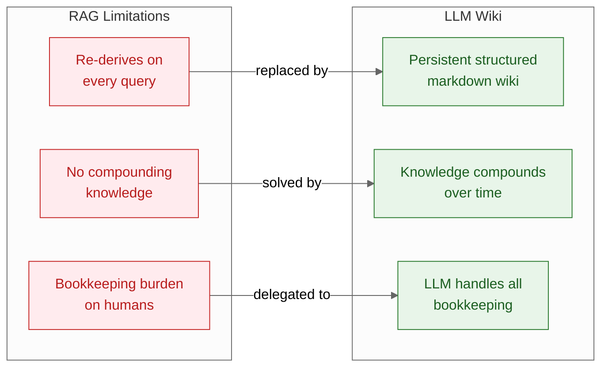
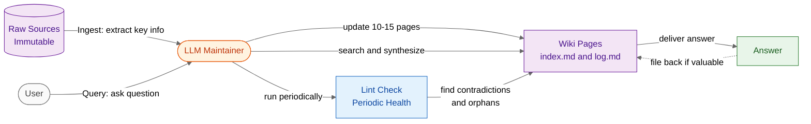

# LLM Wiki — Summary

> RAG re-derives knowledge on every query and collapses under bookkeeping burden — LLM Wiki replaces it with a persistent, LLM-maintained markdown knowledge base that compounds over time.

**Sources analyzed:** [LLM Wiki: A Pattern for Personal Knowledge Bases](https://gist.github.com/karpathy/442a6bf555914893e9891c11519de94f) by Andrej Karpathy
**Generated:** 2026-07-28

---

## Problem Statement

Retrieval-Augmented Generation (RAG) is the dominant pattern for grounding LLM responses in a personal or organisational corpus. But RAG has a structural flaw: it is stateless. Every query starts from zero — the system retrieves raw documents, synthesises them into an answer, and throws away the work. If the same question is asked again, or a closely related one, the system re-reads the same documents and re-derives the same understanding from scratch. There is no accumulation.

The second failure mode is maintenance abandonment. Human-curated knowledge bases — wikis, Notion databases, Obsidian vaults — begin well but degrade over time. Cross-references rot, contradictions accumulate, orphaned pages multiply, and entries go stale without anyone noticing. Karpathy identifies the root cause precisely: "The tedious part of maintaining a knowledge base is not the reading or the thinking — it's the bookkeeping." Humans are willing to read and think; they are unwilling to track down every page that needs updating when a new fact arrives, resolve every contradiction, or audit for orphaned nodes on a schedule. Knowledge bases fail not from lack of knowledge, but from the administrative overhead of maintaining coherence.

These two problems compound each other. RAG sidesteps the maintenance problem by having no persistent state to maintain — but at the cost of never learning. Human-curated wikis accumulate knowledge but collapse under the bookkeeping burden. Neither pattern produces a knowledge base that is both persistent and coherent over time.

## Solution at a Glance

The LLM Wiki pattern assigns the LLM the role of disciplined wiki maintainer rather than on-demand synthesiser. Instead of retrieving raw documents and answering each query from scratch, the LLM incrementally builds and updates a structured collection of interlinked markdown files — entity pages, concept pages, cross-references — that persist across sessions. When new material arrives, the LLM ingests it by updating the relevant pages and appending to an audit log. When a user poses a question, the LLM searches the wiki (not the raw sources) and synthesises an answer from pages it already understands. Periodically, the LLM runs a lint pass to surface contradictions, orphaned pages, and stale claims. The knowledge base therefore compounds: every ingest, every query, every lint cycle makes it more complete and coherent.

---

## Part I: Conceptual Overview

### Purpose

LLM Wiki exists to solve the compounding knowledge problem that both RAG and human-maintained wikis fail at differently. The pattern is grounded in a specific division of labour: humans curate what sources are worth reading; the LLM handles all of the administrative overhead — updating pages, tracking cross-references, resolving contradictions, flagging staleness. A configuration document (Karpathy uses `CLAUDE.md` as the example) defines the wiki's structure, conventions, and operational workflows, effectively turning the LLM from a generic chatbot into a disciplined knowledge-base maintainer with a clear job description.

The philosophy is that knowledge should be a compounding asset. Each ingest should make future queries cheaper and more accurate. Each query, if the answer is novel, should make the wiki slightly more complete. The system is designed so that work is never thrown away.

### Core Concepts

**Persistent wiki:** A collection of markdown files that survive across sessions, accumulate over time, and form the LLM's working knowledge layer. Unlike an in-context summary or a one-off RAG response, the wiki exists as a first-class artifact that grows more valuable with use.

**Three-layer structure:** Raw sources (immutable, curated by humans), the wiki (LLM-generated and LLM-maintained markdown), and the schema (a configuration document that defines structure and conventions). Each layer has a distinct owner and a distinct mutability contract.

**Three operations:** Ingest, Query, and Lint are the only things the LLM does to the wiki. Each has a clear trigger, a bounded scope (ingest touches 10–15 pages; lint touches the whole wiki periodically), and a defined output.

**Schema-driven behaviour:** The configuration document (e.g., `CLAUDE.md`) is what transforms a capable LLM into a consistent maintainer. Without it, the LLM would improvise structure. With it, the LLM follows the same conventions across every session, producing a wiki that is internally coherent regardless of which session generated each page.

**Compounding value:** The key property the pattern optimises for. Every operation adds value to the wiki rather than discarding it. A good query answer is filed back into the wiki. An ingest doesn't just answer today's question — it updates all related pages so that future queries benefit.

### Strengths

**Eliminates repeated synthesis work.** Once a concept, entity, or relationship has been ingested and written into the wiki, the LLM does not re-read the raw sources to answer questions about it. Queries are answered from pages the LLM already understands, which is faster and more consistent.

**Plays to LLM strengths.** LLMs are particularly good at the exact tasks the pattern assigns them: reading comprehension, summarisation, cross-referencing, and consistency checking. The bookkeeping tasks that cause human-maintained wikis to collapse are precisely the tasks LLMs perform reliably and tirelessly.

**Self-improving system.** The lint operation means the wiki actively heals itself. Contradictions that would silently accumulate in a human-maintained wiki get surfaced and resolved. Orphaned pages get re-linked. The system has a mechanism for maintaining coherence even as it grows.

**Domain-agnostic and lightweight.** The pattern requires no specialised infrastructure beyond a file system and an LLM. It intentionally remains abstract and encourages users to instantiate it for their specific domain with their own schema document.

**Good answers compound.** When a query produces a novel, high-quality synthesis, that answer is filed back into the wiki as a new page. The act of querying enriches the knowledge base for all future queries.

### Weaknesses

**No ground-truth verification.** The LLM writes and maintains the wiki based on its own reading of raw sources. Factual errors introduced during ingest — misreadings, hallucinations, over-confident synthesis — get baked into the wiki and may propagate through cross-references without correction unless the lint pass catches them.

**Cold-start problem.** An empty wiki provides no benefit over RAG. The system only becomes valuable after significant ingest work, which requires a series of sessions before query quality meaningfully exceeds a naive RAG baseline.

**Intentionally abstract specification.** The gist describes the pattern at a high level and explicitly leaves instantiation to the user. There is no reference implementation, no tooling, and no community of practice to draw from. Users must design their own schema document, page structure, and lint conventions from scratch.

**LLM session context limits.** As the wiki grows, the LLM cannot read every page in a single context window. The pattern does not specify how to handle selective retrieval from a large wiki — the same retrieval problem that motivates RAG reappears at the wiki layer.

### Tradeoffs

**Compounding depth vs. cold-start cost.** The wiki becomes more valuable over time, but requires sustained investment before it pays off. RAG is immediately useful on any corpus; LLM Wiki starts weak and grows strong.

**Consistency vs. groundedness.** The wiki layer provides consistent, cross-referenced knowledge, but introduces an intermediary that can diverge from the raw sources. RAG answers from raw sources directly, which is more grounded but less consistent.

**LLM owns coherence vs. human owns coherence.** Delegating bookkeeping to the LLM removes the maintenance burden from humans but also removes human oversight of the knowledge structure. A poorly configured schema or an LLM error can silently degrade the wiki's coherence.

**Flexibility vs. structure.** The schema-driven approach enforces consistent wiki structure, which is a strength for coherence but a constraint for domains where organic structure is more appropriate.

### Costs & Caveats

**Schema design is non-trivial.** The quality of the wiki depends heavily on the schema document. A vague or incomplete schema produces an incoherent wiki. Users must invest time in designing page templates, category structures, cross-referencing conventions, and lint criteria before the first ingest — or accept significant rework later.

**Token cost scales with wiki size.** Ingest and lint operations touch many pages, and as the wiki grows, so does the cost of maintaining it. The gist mentions optional CLI tools and MCP servers for search efficiency at scale, but does not specify when they become necessary or what performance thresholds to watch.

**Lint frequency is unspecified.** The pattern describes lint as a periodic health check but does not prescribe how often to run it. Running it too rarely allows contradictions to compound; running it too frequently burns tokens on a wiki that has not changed much.

**Single-author assumption.** The pattern is designed for personal or small-team use. It does not address concurrent edits, version conflicts, or multi-user write access to the wiki layer.

---

## Part II: Technical & Architectural Overview

> *Partially included — the three-layer architecture, three operations, and supporting file structure are specified; specific technologies, LLM selection, and implementation details are intentionally left abstract.*

### Architecture Overview

The system has three distinct layers with clear mutability contracts: raw sources at the bottom (immutable, curated by humans), the wiki in the middle (LLM-generated and LLM-maintained markdown files), and the query interface at the top (where users interact and answers are returned). The LLM acts as the sole writer to the wiki layer, operating through three named operations: Ingest, Query, and Lint. Two special files, `index.md` and `log.md`, serve as the navigational and audit infrastructure for the wiki.

### Key Components

**Raw Sources layer.** Immutable documents — articles, PDFs, images — curated by the human. The LLM reads from this layer during ingest but never writes to it. This is the source of truth for facts; the wiki is a derived, synthesised view.

**Wiki layer.** LLM-generated and LLM-maintained markdown files. Contains entity pages (one per notable person, project, or concept), concept pages (explanations of ideas), and cross-references (links between pages). The LLM is the sole author of this layer.

**index.md.** A content-oriented catalog of the wiki, organised by category. Serves as the entry point for navigation, analogous to a table of contents. The LLM updates it during ingest when new pages are created.

**log.md.** An append-only chronological record of every ingest and query operation. Provides an audit trail and allows users to review what the LLM has processed. Never modified retroactively — only appended to.

**Schema document (e.g., CLAUDE.md).** The configuration document that defines wiki structure, page templates, naming conventions, and operational workflows. This is the instruction set that transforms the LLM from a generic assistant into a disciplined wiki maintainer. Its quality determines the wiki's coherence.

**Optional search tooling.** The pattern mentions local search engines, CLI utilities, and MCP servers as optional enhancements for efficiency at scale. These are not required for the pattern to function and are not specified beyond brief mention.

### Technology Choices

The pattern is intentionally technology-agnostic. The only concrete choice is **markdown** as the storage format for the wiki layer — chosen for its human-readability, LLM-friendliness, and compatibility with a wide range of editors and tools. The LLM itself, the file system, the schema format, and the search tooling are all left to the user to decide. The gist uses `CLAUDE.md` as an example schema filename, suggesting Claude as one possible LLM, but this is not mandated.

### Data Flows

**Ingest flow:** A new raw source arrives → the LLM reads it and extracts key information → the LLM identifies 10–15 wiki pages relevant to the new material → each page is updated with new facts, cross-references corrected, and contradictions noted → an ingest record is appended to `log.md` → `index.md` is updated if new pages were created.

**Query flow:** A user asks a question → the LLM searches the wiki for relevant pages → the LLM synthesises an answer from those pages → the answer is returned to the user → if the answer represents a novel synthesis not already in the wiki, it is filed back as a new page, and a query record is appended to `log.md`.

**Lint flow:** Triggered periodically → the LLM reads the wiki and checks for contradictions between pages, orphaned pages with no inbound links, stale claims that may have been superseded, and missing cross-references → findings are surfaced for human review or resolved directly by the LLM depending on the schema's lint conventions.

---

## External References

- [Retrieval-Augmented Generation (RAG)](https://en.wikipedia.org/wiki/Retrieval-augmented_generation) — the dominant prior approach that LLM Wiki is positioned against; re-derives knowledge on every query
- [CLAUDE.md convention](https://docs.anthropic.com/en/docs/claude-code/memory) — the configuration file format Karpathy references as an example schema document for governing LLM behaviour
- [Model Context Protocol (MCP)](https://modelcontextprotocol.io/) — mentioned as an optional integration for search tooling at scale
- [Obsidian](https://obsidian.md/) — a representative example of the human-maintained wiki tools this pattern is designed to outperform in maintenance resilience
- [Andrej Karpathy](https://karpathy.ai/) — author of the gist; former Director of AI at Tesla, co-founder of OpenAI

---

## Source Material

- [LLM Wiki: A Pattern for Personal Knowledge Bases](https://gist.github.com/karpathy/442a6bf555914893e9891c11519de94f) — Andrej Karpathy's original gist

---

## Key Takeaways

- **The bookkeeping insight is the core:** LLM Wiki's central claim is not that LLMs are smarter than humans at synthesis — it's that LLMs are more willing than humans to do the administrative maintenance that knowledge bases require to stay coherent. Delegating that specific burden is what makes the pattern viable.
- **Compounding is the key advantage over RAG:** A RAG system has the same capabilities on day one and day one hundred. An LLM Wiki gets measurably better over time — queries answered from a mature wiki are faster, more cross-referenced, and more consistent than anything RAG can produce from raw documents.
- **The schema document is the highest-leverage investment:** The quality of the wiki depends almost entirely on the quality of the schema. A well-designed schema produces a self-healing, coherent knowledge base; a vague one produces a growing pile of inconsistent markdown files.
- **The pattern is a design pattern, not a product:** There is no reference implementation, no tooling, and no community standard. Users must design their own instantiation, which means the pattern's value is entirely realised or squandered in that design work.
- **Lint is what separates this from a glorified note-taking system:** Without periodic lint, the wiki degrades just like any human-maintained wiki. Lint is the mechanism that makes the system self-correcting and keeps the "compounding" property from becoming "compounding errors."

---

## Conclusion

LLM Wiki is an emerging design pattern — described in a single gist, intentionally abstract, with no reference implementation — that addresses a genuine structural weakness in RAG and human-maintained knowledge bases. It is best suited to individual practitioners or small teams with a sustained, high-volume reading practice who are willing to invest in schema design upfront and maintain the habit of running ingest, query, and lint operations consistently. The single most important caveat is that the pattern's value proposition depends entirely on the quality and discipline of the schema document: without a well-designed `CLAUDE.md`-equivalent, the LLM has no consistent job description, and the wiki drifts into incoherence just as quickly as the human-maintained systems it replaces.
