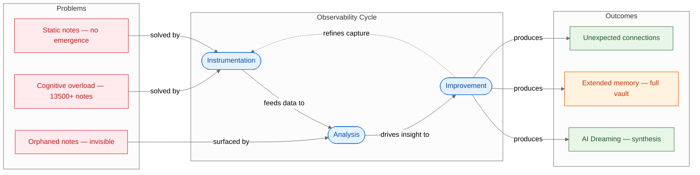
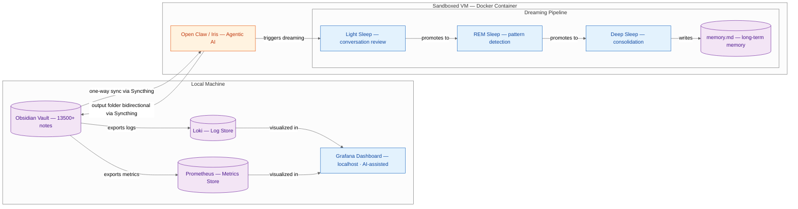

# PKM Observability & AI Dreaming — Summary

> PKM vaults of thousands of notes become invisible and inert without observability — applying software monitoring principles plus a sandboxed agentic AI unlocks synthesis and meaning from your own knowledge.

**Sources analyzed:** [Do Androids Dream of Second Brains? : Observability and AI for PKM](https://www.youtube.com/watch?v=BeuaPO0Ezuk) — Nicole van der Hoeven (43-min talk, originally presented at PKM Summit Utrecht)
**Generated:** 2026-07-28

---

## Problem Statement

Personal knowledge management systems like Obsidian promise to become a "second brain," yet in practice most large vaults devolve into sprawling graveyards of disconnected notes. Nicole van der Hoeven — a developer advocate at Grafana who manages over 13,500 notes — frames the core failure mode precisely: a note that has no backlinks and is never surfaced again has value only at the moment of writing. Without discoverability, it might as well not exist. In her own vault, even after deliberate effort, 95 orphaned notes (notes linked to nothing) remained — invisible accumulation that cannot contribute to understanding.

The second problem is cognitive scale. The human mind cannot hold 13,500 items in working memory simultaneously to find cross-note patterns, identify unexplored topic clusters, or trace which subtopics appear in 40 scattered notes but have never been synthesised into a single coherent map. This is a structural limit, not a discipline failure. No PKM practice alone addresses it without external tooling.

The third problem is the absence of "vault health" visibility. Users have no dashboard showing how many notes were created this week versus last week, what the most-linked nodes are (potential map-of-content candidates), which topics appear frequently but have never become published content, or what time of day note-taking activity peaks. Without this observability, users optimise by feel rather than evidence — and may not notice that their system is quietly degrading.

Finally, the framing problem: calling a note system a "second brain" encourages passive accumulation over active synthesis. The presenter argues notes are "context" — raw data lying dormant — and that the missing ingredient is not more notes but a layer that observes the system, spots patterns, and surfaces meaning the human owner cannot derive alone.

## Solution at a Glance

The solution borrows the software engineering discipline of **observability** — the practice of instrumenting a system, analysing its telemetry, and using that insight to improve it — and applies it to a personal knowledge vault. An Obsidian vault emits logs (frontmatter properties, modification timestamps, tags, links) and metrics (note counts, word counts, link density, orphan rates), which flow into purpose-built time-series databases (Loki and Prometheus) and are visualised locally in Grafana. Separately, a sandboxed agentic AI assistant (Open Claw, nicknamed "Iris") receives a synced read-only copy of the vault and performs synthesis tasks the human owner cannot: backlink gap analysis, topic-cluster identification, and a biologically-inspired "dreaming" pipeline that consolidates memory across sessions — surfacing insights that become long-term context for the agent.

---

## Part I: Conceptual Overview

### Purpose

This approach exists because traditional PKM tools solve capture and retrieval but not emergence. Obsidian, Roam, Notion, and similar tools give you a place to put things; they do not tell you what those things mean in aggregate. The presenter draws an explicit analogy to software observability: a complex distributed system is also "hopelessly complex," no single engineer knows the full state, and without instrumentation the system is a black box. The same is true of a vault with 13,500 notes.

The deeper philosophical argument (drawn from Philip K. Dick's *Do Androids Dream of Electric Sheep?* and the Zhuangzi butterfly paradox) is that the meaningful question is not "can this AI replace my brain?" but "can it *dream* — can it do synthesis in the background that creates meaning neither of us could generate alone?" The Voigt-Kampff test in the novel measures empathy through observable physiological proxies; the presenter reframes this: what the test actually measures is **observability**, and observability is the first prerequisite for any intelligence, human or machine.

### Core Concepts

**Observability** (borrowed from computing): The measure of how much can be inferred about the inner workings of a system based on its outputs. For a PKM system, the "outputs" are logs (textual event records: file paths, tags, creation/modification timestamps) and metrics (numerical aggregations: note counts, word counts, links per node, orphan counts).

**Instrumentation**: Adding probes to a system so it emits telemetry. For Obsidian, this means extracting frontmatter properties and file metadata into structured data stores. The Obsidian Dataview plugin already tracks much of this; the innovation is piping it to external time-series databases.

**Synthesis vs. accumulation**: The core distinction driving the entire framework. Accumulation is passive (adding notes); synthesis is active (finding connections, deriving meaning). The three-step observability cycle — Instrumentation → Analysis → Improvement — is the mechanism for turning accumulation into synthesis.

**Dreaming**: Open Claw's memory consolidation feature, deliberately mapped to biological sleep phases. Light sleep reviews recent conversations and scores memories by confidence, relevance, and recency. REM sleep promotes high-scoring memories for deeper processing. Deep sleep consolidates the most significant patterns into `memory.md` — a permanent long-term memory file that persists across sessions. This is synthesis happening without the human actively in the loop: the agent is "dreaming" over the vault.

**Agentic AI (vs. generative AI)**: Standard LLM tools (ChatGPT, Claude.ai) generate responses but take no autonomous actions. Agentic AI tools like Open Claw can execute actions — read files, write outputs, run commands — given permission. The presenter describes this as having "hands in addition to a mouth." Sandboxing (Docker container in a VM, Syncthing one-way sync) limits the blast radius.

### Strengths

**Vault health is visible in numbers.** Orphan note counts, links per node, activity heat maps, and most-linked topics appear in a Grafana dashboard that updates in real time. The presenter discovered 95 orphaned notes she didn't know existed and could immediately see which were candidates for linking.

**Natural language interrogation without query writing.** Grafana's AI assistant (backed by Anthropic models) allows questions like "what time of day am I most active at updating notes?" without writing any database query — the assistant generates and executes the query, then answers in plain language. It also updated dashboard panels on request, propagating the change to all matching panels automatically.

**Synthesis at vault scale.** Open Claw / Iris can hold more context than a human mind. In a live demo, it generated a comprehensive map-of-content for "observability" that correctly linked real notes the presenter had not explicitly connected — cross-referencing thousands of notes and finding relationships that would take hours to surface manually.

**Content ideation from existing knowledge.** When asked to identify topic clusters in the vault that haven't become content yet, Iris surfaced specific, nuanced ideas (e.g., "What changes about a marriage when both partners know everything is being captured?") grounded in real vault notes — not generic suggestions.

**OCR and handwriting integration.** Iris successfully OCR-ed handwritten Remarkable tablet notes and paper journal pages, making them searchable and feeding them back into the vault — closing a longstanding gap in analog-to-digital PKM workflows.

**Data stays local.** Grafana runs on localhost. Syncthing is peer-to-peer with no intermediary server. Vault data never leaves the local machine.

### Weaknesses

**Cost is non-trivial.** The presenter mentions costs reaching $58/day when using frontier models with Open Claw on heavy usage days. This is a real barrier for casual PKM users.

**Setup complexity is significant.** The full stack requires: Obsidian with Dataview plugin, a data extraction script, Loki, Prometheus, Grafana (locally configured), a VM with Docker, Open Claw installed, and Syncthing with selective folder sync. This is a competent-developer setup, not a click-to-install product.

**Open Claw carries inherent risk.** The presenter explicitly warns that agentic tools with write access "can be dangerous." She sandboxed it in a VM and restricted Syncthing to mostly one-way sync specifically because giving an agentic AI unrestricted vault access is a risk she was unwilling to take.

**AI hallucination in research tasks.** When Iris performed benchmark research, some links pointed to a site rather than a specific paper, and links were occasionally imprecise. Human review before publishing AI-generated research remains necessary.

**Dreaming is still experimental.** The memory consolidation feature was new at the time of the talk. Its long-term reliability, what it promotes vs. discards, and whether `memory.md` stays coherent over months of use are open questions.

### Tradeoffs

- **Full local control ↔ setup friction**: Running Grafana/Loki/Prometheus locally keeps data private but requires ongoing DevOps effort (updates, config, port management).
- **Agentic autonomy ↔ blast radius**: Giving Iris a write-enabled output folder enables genuine synthesis; one-way sync prevents accidental vault corruption, but also limits what she can proactively improve.
- **Frontier model quality ↔ cost**: Better models produce dramatically better synthesis results, but at potentially $58/day. Smaller or local models reduce cost but degrade synthesis quality.
- **Automated synthesis ↔ human ownership**: The presenter remains "in the loop" — Iris produces drafts and maps that the human selectively merges. Full automation would risk losing the intentionality that makes a PKM system personal.
- **Depth of instrumentation ↔ note-taking overhead**: Rich frontmatter properties (required for metrics) impose an upfront authoring cost on every note. The payoff is high but only after sustained consistent use.

### Costs & Caveats

The full stack is not a packaged product. A practitioner needs familiarity with Docker, basic database configuration, and Grafana panel setup (though the AI Assistant significantly reduces this last point). Open Claw specifically is described as requiring caution — the presenter says she "would be very careful about recommending that people just jump into it."

The observability value compounds with vault age and size. A 300-note vault would not justify this infrastructure. At 13,500 notes with years of accumulated Dataview metadata, the signal-to-noise ratio is high.

Data privacy is context-dependent. The local setup protects against third-party data exposure, but sending queries to Grafana's AI assistant transmits query text and potentially data to external Anthropic APIs. Users with sensitive notes should audit what Grafana Assistant actually transmits.

---

## Part II: Technical & Architectural Overview

> *Included because the source specifies implementation details.*

### Architecture Overview

The system has three distinct layers: an **instrumentation layer** (Obsidian vault → Loki + Prometheus), an **analysis layer** (Grafana dashboard running on localhost), and an **improvement layer** (Open Claw / Iris, sandboxed in a Docker VM, with a memory consolidation pipeline). A peer-to-peer sync tool (Syncthing) bridges the local machine and the VM, with directional sync control preventing the agent from modifying the canonical vault directly.

The observability stack (Loki, Prometheus, Grafana) is entirely local — no cloud dependency. The AI agent stack (Open Claw) runs in a separate isolated environment, receives a mostly read-only mirror of the vault, and writes outputs to a single controlled folder that syncs back.

### Key Components

**Obsidian** — the canonical PKM tool and data source. Stores 13,500+ notes as markdown files with YAML frontmatter. The Obsidian Dataview plugin enables rich frontmatter querying. Obsidian is the only system with write authority over the canonical vault.

**Loki** — open-source log aggregation database (by Grafana Labs). Receives text-based event records from the Obsidian vault: file paths, tags, creation/modification timestamps, vault membership. Optimised for log queries and text filtering.

**Prometheus** — open-source metrics database. Receives numerical aggregations: total note count, word count, link counts, orphan counts, notes modified per day. Optimised for time-series metrics.

**Grafana** — open-source visualisation platform running on localhost. Provides the dashboard frontend, executes queries against Loki and Prometheus, and hosts the Grafana AI Assistant which can generate new dashboard panels from natural language and answer ad hoc questions about the data.

**Syncthing** — open-source peer-to-peer file sync. No intermediary server; syncs directly between the local machine and the VM. Configured with selective folder sync (only specific vault folders) and directional control (mostly one-way to the VM; one bidirectional folder for Iris outputs).

**Open Claw (nicknamed "Iris")** — open-source agentic AI framework. Runs inside a Docker container in a VM, providing a sandbox. Has read access to the synced vault copy and write access to a single output folder. Can browse the web, execute code, and maintain persistent memory via the dreaming pipeline.

**Dreaming pipeline** — Open Claw's memory consolidation feature, modelled on biological sleep phases:
- *Light sleep*: Reviews conversations from the current session, scores memories by six factors (confidence, relevance, recency, frequency, etc.), bumps scores for repeated topics
- *REM sleep*: Elevates high-scoring memories for cross-session pattern detection; the presenter saw it spotting patterns spanning multiple days
- *Deep sleep*: Selects the most significant patterns and writes them to `memory.md`
- *memory.md*: Permanent long-term memory file; stores user context (personal facts, recurring themes, work-in-progress patterns) that persists across all future sessions

### Technology Choices

| Component | Technology | Mandated / Suggested |
|---|---|---|
| Note-taking | Obsidian | Mandated (system is built around its file format and Dataview) |
| Log store | Loki | Suggested (any log database would work) |
| Metrics store | Prometheus | Suggested (any time-series DB would work) |
| Visualisation | Grafana | Mandated (AI Assistant feature is Grafana-specific) |
| Agentic AI | Open Claw | Mandated (dreaming feature is Open Claw-specific) |
| Sync | Syncthing | Suggested (chosen for P2P, no-server architecture) |
| LLM backend | Frontier model (Anthropic) | Suggested (smaller/local models would reduce cost) |
| Containerisation | Docker + VM | Suggested (any sandbox would work) |
| Frontmatter metadata | Obsidian Dataview plugin | Mandated (required to have structured properties to export) |

### Data Flows

1. **Instrumentation flow**: Obsidian vault files → extraction script parses YAML frontmatter, modification timestamps, link structure → log events sent to Loki, numerical metrics sent to Prometheus

2. **Analysis flow**: User or Grafana AI Assistant queries Loki/Prometheus → Grafana renders panels (note counts, link distribution, activity heat maps, orphan lists, most-linked notes, word frequency) → user reviews dashboard for vault health and acts on surfaced issues

3. **AI sync flow**: Syncthing replicates vault to VM (one-way, selective folders) → Open Claw / Iris reads vault copy with full context window

4. **Synthesis flow**: User tasks Iris with specific analyses (backlink gaps, topic clusters, OCR, research) → Iris produces outputs in designated folder → Syncthing syncs outputs back to local machine → user reviews, selectively merges into canonical vault

5. **Dreaming flow**: Open Claw runs dreaming pipeline after sessions → light/REM/deep sleep phases score and consolidate memories → significant patterns promoted to `memory.md` → Iris enters subsequent sessions with persistent context about user work patterns

---

## External References

- [Obsidian](https://obsidian.md) — the PKM markdown note-taking tool the entire system is built around
- [Obsidian Dataview plugin](https://github.com/blacksmithgu/obsidian-dataview) — enables structured queries and rich frontmatter properties inside Obsidian
- [Grafana](https://grafana.com) — open-source observability and data visualisation platform; provides dashboard + AI Assistant
- [Loki](https://grafana.com/oss/loki/) — open-source log aggregation database by Grafana Labs
- [Prometheus](https://prometheus.io) — open-source metrics and time-series database
- [Open Claw](https://github.com/openclaw) — open-source agentic AI framework with memory/dreaming features
- [Syncthing](https://syncthing.net) — open-source peer-to-peer file synchronisation, no central server
- [Readwise](https://readwise.io) — highlight and note import tool; used to pull annotations into the Obsidian vault (filtered from orphan metrics)
- [Remarkable](https://remarkable.com) — e-ink digital writing tablet; presenter uses it for handwritten notes that Iris OCRs
- [K6](https://k6.io) — open-source load testing tool; one of the presenter's most-linked topics in her vault
- [Plaud](https://www.plaud.ai), [Granola](https://www.granola.so), [Voice Notes](https://voicenotes.com) — audio recording and transcription tools used for life logging
- [Cursor](https://cursor.com) — AI-assisted code editor (VS Code fork); used to inspect Open Claw's dreaming memory files
- *Do Androids Dream of Electric Sheep?* by Philip K. Dick — novel whose Voigt-Kampff test and "tyranny of an object" quote frame the talk's argument about observability vs. empathy
- Zhuangzi butterfly paradox — Chinese philosophical text; quoted to argue that dreaming is bidirectional synthesis between mind and system
- [PKM Summit](https://pkmsummit.com) — conference in Utrecht, Netherlands where the original version of this talk was delivered
- Jorge Arango — author and information architect; PKM Summit speaker also critical of the "second brain" framing
- Anthropic — AI company whose models power Grafana AI Assistant in the demo

---

## Source Material

- [Do Androids Dream of Second Brains? : Observability and AI for PKM](https://www.youtube.com/watch?v=BeuaPO0Ezuk) — Nicole van der Hoeven (YouTube, 43:19)

---

## Key Takeaways

- **Observability before intelligence**: A PKM vault with no metrics is a black box to its own owner. Applying the software triad of Instrumentation → Analysis → Improvement turns passive accumulation into an observable system — visible problems (orphan notes, link deserts) can then be acted on.
- **The gap between storage and synthesis is the real problem**: Having 13,500 notes is not valuable by itself; deriving connections and meaning from them is. The "second brain" framing fails precisely because it conflates accumulation with cognition.
- **Agentic AI fills a structural cognitive gap**: Open Claw / Iris can hold the entire vault in context simultaneously, finding cross-note connections the human owner cannot see. This is not about replacing thinking — it's about extending the scale at which meaningful synthesis can happen.
- **Dreaming is the bridge from observation to meaning**: The biologically-inspired memory consolidation pipeline (light sleep → REM → deep sleep → memory.md) turns short-term conversation context into long-term agent memory — effectively teaching the AI assistant about the user's patterns over time.
- **Sandboxing is non-negotiable for agentic tools**: Giving an agent with autonomous capabilities full write access to a primary vault is a meaningful risk. The one-way Syncthing sync with a single controlled output folder is the key safety design that makes this setup viable.

---

## Conclusion

This solution is niche but well-reasoned: it targets power PKM users with large vaults, developer-level comfort with open-source infrastructure, and willingness to treat their note system as software under observation. It is emerging rather than established — key components (Open Claw's dreaming feature, Grafana AI Assistant) were new at the time of the talk, and the full stack has no single packaged installer. The conditions that favour adoption are: a vault of several thousand notes with structured frontmatter, prior experience with Docker and local database tooling, and comfort with frontier-model API costs. The single most important caveat is cost and complexity: at up to $58/day on heavy usage days and with a multi-component stack requiring ongoing maintenance, this is not a casual weekend project — it is an engineering commitment to treating personal knowledge as infrastructure.
