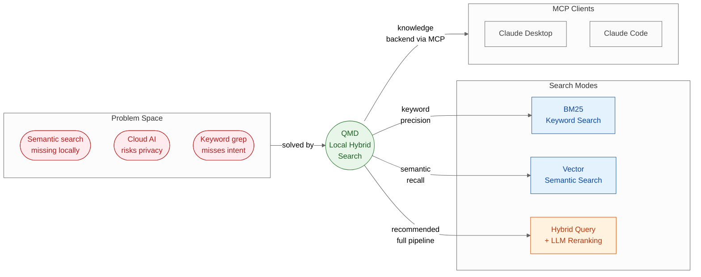
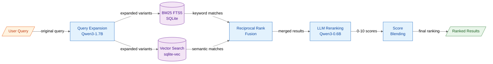

# QMD — Query Markup Documents — Summary

> Local markdown notes lack semantic search without exposing data to the cloud; QMD solves this with a fully offline hybrid BM25 + vector + LLM-reranking pipeline that doubles as an MCP knowledge backend for Claude.

**Sources analyzed:** [tobi/qmd on GitHub](https://github.com/tobi/qmd)
**Generated:** 2026-07-28

---

## Problem Statement

Personal knowledge management has two unsolved tensions. First, semantic search — the ability to ask "what did we decide about caching strategy?" and surface relevant notes even when no exact keywords match — has traditionally required sending data to a cloud AI service. For individuals with private notes, meeting transcripts, or proprietary documentation, this is an unacceptable tradeoff.

Second, keyword-based full-text search (grep, FTS5, Spotlight) is fast and private, but brittle: it finds documents that contain the words, not documents that express the intent. A note about "auth token expiry handling" won't surface for the query "session timeout logic" unless those exact words appear.

The problem is compounded for developers and knowledge workers who use Claude (via Claude Desktop or Claude Code): Claude operates with a context window and has no persistent memory of your local files. Without a retrieval backend, Claude cannot answer questions about your notes, past decisions, or local documentation.

Standard retrieval-augmented generation (RAG) solutions solve part of this, but they require either cloud infrastructure (OpenAI embeddings API, Pinecone, etc.) or complex self-hosted stacks — high friction for a single developer trying to search their own `~/notes` folder.

## Solution at a Glance

QMD is a local, offline hybrid search engine for markdown files distributed as a Node.js/Bun CLI and library. It indexes your markdown collections into a SQLite database using both BM25 full-text search and vector embeddings, then combines the two with an LLM reranking step — all running on local GGUF models with no network required. It also exposes an MCP server so Claude Desktop and Claude Code can query your personal knowledge base as a first-class tool.

---

## Part I: Conceptual Overview

### Purpose

QMD exists at the intersection of three trends that recently became practical simultaneously: small GGUF models efficient enough to run on consumer hardware, SQLite's FTS5 and vector extensions becoming mature, and the MCP protocol providing a standard way for AI assistants to call local tools. Its design philosophy is privacy-first: no data leaves the machine, no API keys, no cloud dependencies. The tool is built by Tobi Lutke (Shopify CEO) and reflects a pragmatic, engineering-driven approach — batteries included, opinionated defaults, but extensible.

### Core Concepts

QMD introduces several vocabulary terms worth understanding:

- **Collection** — a named pointer to a directory of markdown files, with optional glob patterns, exclusions, and per-path context metadata.
- **Context** — hierarchical text descriptions attached to path prefixes (e.g., `/journal/2025 → "Daily notes from 2025"`) that the LLM reranker uses to understand what a document is *about* without reading it.
- **Docid** — a content-addressed short ID (first 6 characters of the content hash) that provides stable references to chunks across re-indexes.
- **Chunk** — the unit of search. Documents are split into ~900-token chunks with 15% overlap by default; code files are chunked at AST-level function/class boundaries via tree-sitter.
- **Hybrid Query** — the recommended search mode: query expansion → parallel BM25 + vector → RRF merge → LLM reranking → score blending.

### Strengths

- **Fully offline and private.** All indexing, embedding, and reranking runs locally via GGUF models. No API keys, no data egress, GDPR-friendly by construction.
- **Hybrid search consistently outperforms single-method search.** Combining BM25 keyword precision with vector semantic recall, then applying LLM reranking, captures what neither approach finds alone.
- **MCP-native integration.** QMD ships as a first-class MCP server (stdio and HTTP transports), making it immediately usable as a Claude knowledge backend without any custom glue code.
- **AST-aware chunking for code.** TypeScript, Python, Go, and Rust files are chunked at function and class boundaries using tree-sitter, preserving semantic units that token-window chunking would split mid-function.
- **Context hierarchy guides reranking.** Per-path descriptions let the LLM reranker understand document purpose without embedding context into every file.
- **Dual runtime support.** Runs identically under Node.js ≥ 22 and Bun ≥ 1.0.0.
- **SDK mode.** Can be imported as a TypeScript library (`createStore`) for programmatic use, not just invoked as a CLI.
- **Pre-update hooks.** Collections can run arbitrary shell commands (e.g., `git pull --ff-only`) before re-indexing, enabling auto-synced wiki collections.

### Weaknesses

- **~2 GB mandatory model download on first use.** Three local GGUF models (embedding ~300 MB, reranker ~640 MB, query expansion ~1.1 GB) must be downloaded before any search can run. This makes the tool unsuitable for minimal or CI environments.
- **macOS requires Homebrew SQLite.** Apple's system SQLite omits `SQLITE_LOAD_EXTENSION`, breaking the sqlite-vec extension. Bun users must `brew install sqlite`; only the Node.js packaging works around this automatically.
- **Full re-embedding required on model change.** Switching the embedding model via `QMD_EMBED_MODEL` invalidates all stored vectors; the entire collection must be re-embedded.
- **Single-writer SQLite bottleneck.** Despite WAL mode, concurrent writers still serialize; very large parallel indexing jobs will queue.
- **`bun build --compile` is broken.** The compiled binary overwrites the shell entry point and breaks native extension loading; direct compilation to a single binary is not supported.
- **Query expansion model is the largest of the three.** At 1.7B parameters, it is the slowest component on CPU-only hardware.

### Tradeoffs

| Gain | Loss |
|---|---|
| Complete data privacy | ~2 GB of local disk for models |
| Semantic + keyword search in one query | `query` mode is slower than bare `search` due to reranking |
| No cloud API costs or rate limits | Local GPU or CPU performance determines indexing/query speed |
| MCP integration works offline | MCP daemon requires managing a local process |
| AST-aware chunking for code | Requires tree-sitter grammars per language; unsupported languages fall back to regex chunking |
| Stable docids across re-index | Content hash IDs change if the document content changes |

### Costs & Caveats

The most concrete adoption cost is the first-run model download (~2 GB, one-time) and on macOS, `brew install sqlite` as a prerequisite. After that, a full index + embed pass over a large notes vault can take tens of minutes on CPU-only hardware; `QMD_EMBED_PARALLELISM` (capped at 8) controls concurrency. The `--timeout <minutes>` flag on `qmd embed` prevents runaway sessions.

The LLM reranker adds latency to the `query` command; `--no-rerank` is available to skip it when speed matters more than ranking quality. The query expansion model (Qwen3-1.7B) can be the bottleneck on low-RAM machines. Node.js ≥ 22 is required — this rules out environments still on Node 18/20 LTS without a runtime upgrade.

---

## Part II: Technical & Architectural Overview

> *Included because the source specifies implementation details.*

### Architecture Overview

QMD is a single TypeScript package with four distinct layers: a CLI, an MCP server, a core search store, and a SQLite persistence layer. All layers run in the same Node.js/Bun process (or as a background daemon for the HTTP MCP server). The entire system is local — there are no remote service calls after models are downloaded.

The search pipeline is the architectural centrepiece. It operates as a staged linear pipeline with one parallel step (BM25 and vector search run concurrently), an RRF merge, and an LLM reranking pass.

### Key Components

**`src/store.ts` — Core Search Store.** The central engine. Implements the full hybrid query pipeline: query expansion, parallel BM25 and vector retrieval, RRF fusion, reranker invocation, and score blending. Also handles collection management, context storage, and the update/embed workflows.

**`src/llm.ts` — Local LLM Abstraction.** Wraps `node-llama-cpp` for three tasks: generating embeddings (embeddinggemma-300M), expanding queries (Qwen3-1.7B), and reranking results (qwen3-reranker-0.6B). Manages model loading, GGUF format, and GPU/CPU selection.

**`src/db.ts` — Cross-Runtime SQLite Layer.** Abstracts over `better-sqlite3` (Node.js) and Bun's built-in SQLite, handles the macOS Homebrew SQLite extension workaround, and configures WAL mode + busy timeout to prevent `SQLITE_BUSY` errors on concurrent access.

**`src/collections.ts` — YAML Config Management.** Reads and writes `~/.config/qmd/index.yml` (or project-local `.qmd/index.yml`). Manages collection definitions, context hierarchies, ignore patterns, and pre-update hooks.

**`src/cli/qmd.ts` — CLI Entry Point.** Implements all user-facing commands (`search`, `vsearch`, `query`, `update`, `embed`, `collection`, `context`, `get`, `multi-get`, `mcp`, `status`), output formatting (`cli`, `json`, `csv`, `md`, `xml`, `files`), and progress indicators.

**`src/mcp/server.ts` — MCP Server.** Exposes four MCP tools (`query`, `get`, `multi_get`, `status`). Supports stdio transport (for Claude Desktop direct-spawn) and HTTP transport with REST endpoints (`/mcp`, `/query`, `/search`, `/health`). Injects a dynamic system prompt at MCP `initialize` time describing available collections and index health.

**`src/ast.ts` — AST-Aware Chunker.** Uses `web-tree-sitter` with language grammars for TypeScript, Python, Go, and Rust to chunk code files at function, class, and import boundaries rather than at arbitrary token windows.

### Technology Choices

| Layer | Technology | Mandatory / Optional |
|---|---|---|
| Language | TypeScript (ESM) | Mandatory |
| Runtime | Node.js ≥ 22 or Bun ≥ 1.0.0 | Mandatory |
| Full-text search | SQLite FTS5 (BM25) | Mandatory |
| Vector search | sqlite-vec extension | Mandatory |
| Local LLM inference | node-llama-cpp (GGUF models) | Mandatory |
| Code AST chunking | web-tree-sitter | Optional (falls back to regex) |
| Config format | YAML | Mandatory |
| MCP protocol | `@modelcontextprotocol/sdk` v1.29.0 | Mandatory for MCP integration |
| Schema validation | Zod 4.x | Mandatory |
| Test | vitest (Node) / `bun test` (Bun) | Development |

The choice of SQLite as the sole persistence layer (with FTS5 and sqlite-vec extensions) is deliberate: it requires no server process, is trivially portable (a single `.sqlite` file), and supports both BM25 and vector similarity in one database query.

### Data Flows

**Indexing flow (`qmd update` + `qmd embed`):**
1. `update` reads collection config, discovers new/changed markdown files, splits them into chunks, and writes chunks to the SQLite `documents` table and FTS5 index.
2. `embed` reads unembedded chunks from SQLite, passes them through the embeddinggemma-300M model via node-llama-cpp, and writes the resulting vectors to the sqlite-vec table. Parallelism is controlled by `QMD_EMBED_PARALLELISM`.

**Query flow (`qmd query`):**
1. The raw user query is passed to Qwen3-1.7B for expansion into multiple semantically related variants.
2. Expanded variants are used to run BM25 FTS5 and vector cosine similarity searches in parallel.
3. BM25 scores (absolute value normalized) and vector scores (`1 / (1 + distance)`) are merged via Reciprocal Rank Fusion.
4. The top merged candidates are passed to qwen3-reranker-0.6B, which scores each 0–10.
5. Score blending combines retrieval confidence (dominant for top ranks) with reranker scores (more influential for lower ranks), producing the final ordered list.

**MCP tool call flow:**
1. Claude sends a `query` tool call to the QMD MCP server (stdio or HTTP).
2. The server runs the full hybrid query pipeline (steps 1–5 above).
3. Results are returned as a JSON array of chunks with scores, docids, file paths, and matched text.
4. Claude uses the returned chunks as context for its response.

---

## External References

- [node-llama-cpp](https://github.com/withcatai/node-llama-cpp) — GGUF model inference for Node.js; used for embeddings, query expansion, and reranking
- [sqlite-vec](https://github.com/asg017/sqlite-vec) — Vector similarity search as a SQLite extension; the vector retrieval backbone
- [better-sqlite3](https://github.com/WiseLibs/better-sqlite3) — Synchronous SQLite driver for Node.js
- [web-tree-sitter](https://github.com/tree-sitter/tree-sitter) — AST-aware code chunking for TypeScript, Python, Go, and Rust
- [@modelcontextprotocol/sdk](https://github.com/modelcontextprotocol/typescript-sdk) — MCP protocol SDK for the server implementation
- [HuggingFace GGUF model format](https://huggingface.co/docs/hub/en/gguf) — Model format used by all three local models; overridable via `QMD_EMBED_MODEL`
- [Bun SQLite busy-timeout docs](https://bun.sh/docs/api/sqlite#busy-timeout) — Referenced for WAL concurrency configuration
- [XDG Base Directory Specification](https://specifications.freedesktop.org/basedir-spec/latest/) — Honored for config (`XDG_CONFIG_HOME`) and cache (`XDG_CACHE_HOME`) locations

---

## Source Material

- [tobi/qmd — GitHub Repository](https://github.com/tobi/qmd)

---

## Key Takeaways

- **The three-model stack is the product.** QMD's core insight is that query expansion (1.7B) + BM25 + vector + reranking (0.6B) together, all running locally, outperform any single approach — and that in 2026 this is practical on consumer hardware.
- **MCP transforms it from a CLI tool into an AI-native knowledge layer.** The MCP server means QMD isn't just a search tool — it's a persistent, queryable memory backend for Claude that survives context resets.
- **SQLite is the entire infrastructure.** FTS5 + sqlite-vec means no separate vector database, no search service, no server process — just one `.sqlite` file that holds both keyword indexes and embeddings.
- **Context hierarchy is an underrated feature.** The ability to annotate path prefixes with descriptions (`/journal/2025 → "Daily notes from 2025"`) lets the reranker understand document semantics without modifying the source files.
- **The ~2 GB model download is a one-time cost, not ongoing overhead.** After the first run, searches are fully local with no recurring latency from network calls.

---

## Conclusion

QMD is a mature (v2.6.3), actively maintained tool that hits a genuine gap: private, semantic search over local markdown with zero cloud dependency. Its hybrid pipeline approach is well-grounded in retrieval research (BM25 + vector + reranking is a known winning combination), and the MCP integration makes it uniquely valuable as an offline knowledge backend for Claude. The main adoption barrier is the ~2 GB model download and the macOS Homebrew SQLite prerequisite — not conceptual complexity. Teams or individuals who manage significant knowledge in markdown and use Claude regularly will find it the most capable private RAG backend available today without standing up external infrastructure.
