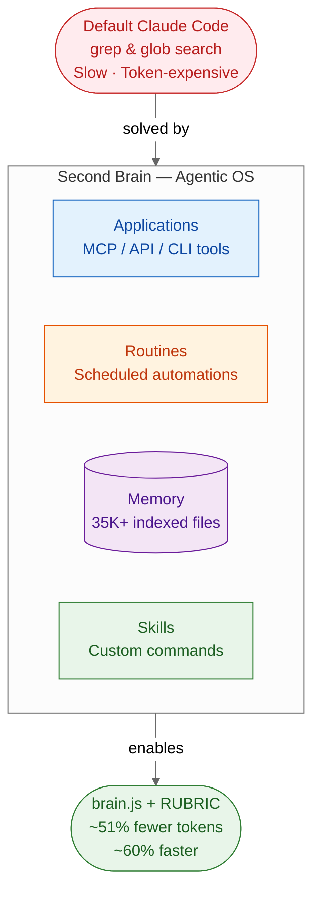
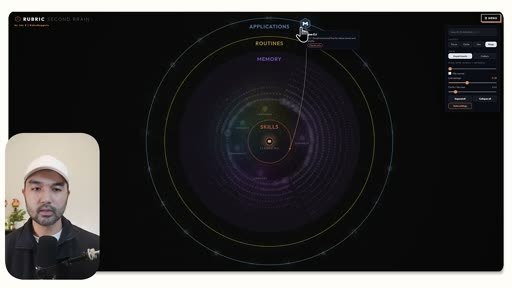
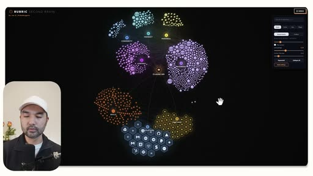
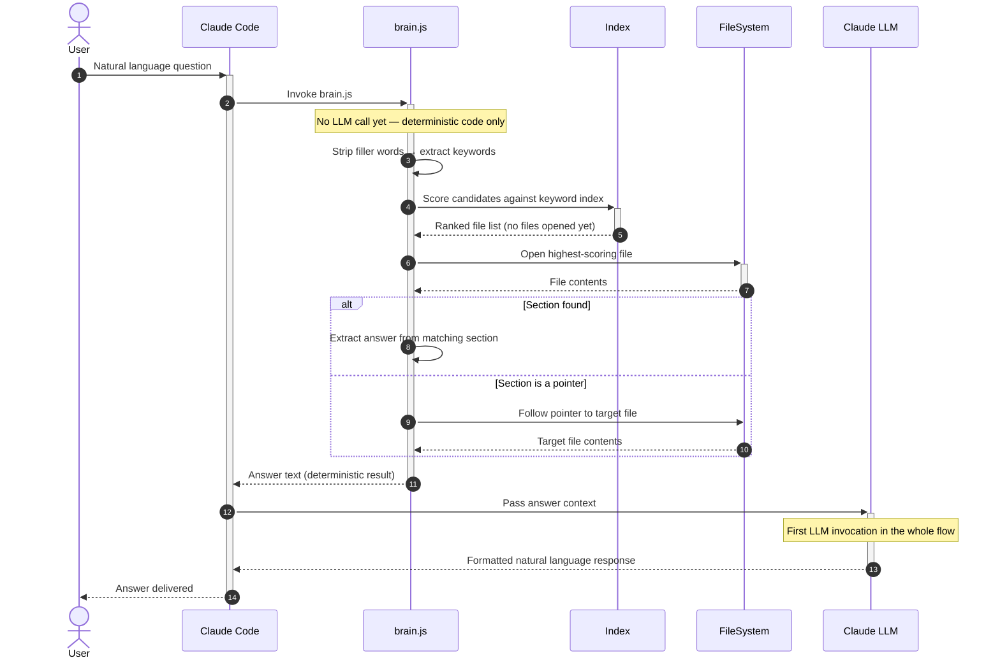
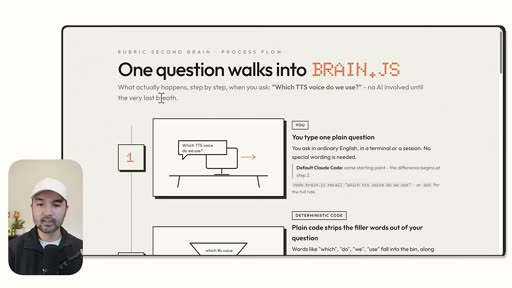
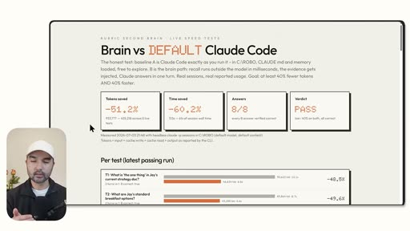

# RUBRIC Second Brain with brain.js — Summary

> Default Claude Code searches your workspace with grep and glob — slow and token-expensive; RUBRIC Second Brain replaces that with a deterministic JavaScript retrieval engine (brain.js) and an interactive visualization layer, cutting token costs by ~51% and retrieval time by ~60%.

**Sources analyzed:** [Build your Ultimate Second Brain with Claude Fable 5](https://youtu.be/VoKiKvgpk78)
**Generated:** 2026-07-28

---

## Problem Statement

Default Claude Code has no map of your workspace. When you ask it to retrieve a document or recall a piece of stored knowledge, it falls back to general-purpose file-search tools — `grep` and `glob` — scanning files one by one until it finds a match. In a workspace with tens of thousands of files, this approach takes multiple turns and burns large amounts of tokens just to locate the information, before the model even begins answering the actual question. The creator demonstrates this directly: a side-by-side test shows the default Claude Code still scanning when the brain.js-powered session has already answered.

The second failure mode is the standard "second brain" mental model. Most productivity systems built around tools like Obsidian produce visually appealing node graphs — webs of interconnected notes — but these graphs carry no actionable information. They show *that* connections exist, not what those connections mean operationally. A user cannot tell from a node graph which applications are plugged into their AI agent, which automations are still running, which files are most accessed, or which skills are available. The visual is a status symbol rather than an instrument.

A third, subtler problem is operational blindness. As an agentic setup grows — more MCP connectors, more scheduled routines, more skills — the user loses track of what is connected. A tool connected to Claude Code can act autonomously (send emails via HubSpot, modify calendar events, post messages). Without a clear map of the application layer, users cannot audit trust exposure or identify stale integrations they no longer need.

## Solution at a Glance

RUBRIC Second Brain is a two-part system built by Claude Fable 5 against your workspace: a dark-theme interactive visualization (RUBRIC) that maps your workspace as four concentric rings — Applications, Routines, Memory, and Skills — and a deterministic JavaScript retrieval engine (brain.js) that intercepts knowledge queries before they reach the LLM, strips filler words, scores indexed files without opening them, and returns the answer with no model inference until the very last step. The result is a workspace assistant that is both auditable (you can see your entire agentic OS in one view) and measurably cheaper to operate.

---

## Part I: Conceptual Overview

### Purpose

The RUBRIC Second Brain exists because agentic productivity has an indexing problem. An LLM agent exploring an unstructured workspace is like a librarian with no card catalogue — capable, but forced to walk every aisle for every request. The solution is not a smarter agent; it is pre-computed structure: indexes, reference maps, and deterministic lookup code that the agent can call instead of searching from scratch. The secondary purpose is legibility: a system you cannot see is a system you cannot govern, and the RUBRIC visualization makes the full agentic operating system inspectable at a glance.

### Core Concepts

The framework rests on four layers that together constitute an "Agentic Operating System":

- **Applications** — every external tool connected to Claude Code via an MCP server, API, or CLI (e.g. Google Calendar, Google Drive, GitHub, HubSpot). The application layer reveals trust exposure: each connected tool can be acted upon autonomously. More nodes mean more power — and more risk.
- **Routines** — scheduled background tasks and automations running independently of interactive sessions (e.g. a Hermes agent running a daily log skill). The routine layer reveals automation debt: forgotten automations that are no longer useful should be retired.
- **Memory** — the full corpus of workspace files (35,466 in the demo), indexed with relationship maps so that any file can be scored for relevance without being opened.
- **Skills** — custom agentic commands, slash commands, and reusable procedures that define what the agent knows how to do.

The RUBRIC visualization renders these four layers as concentric rings in a dark-theme interactive canvas — Applications on the outermost ring, Skills at the center — with each node navigable and expandable. Bubble size encodes file count; color encodes layer type.

### Strengths

The primary strength is **token efficiency through determinism**. brain.js intercepts queries before any LLM call, executes a keyword-match and scoring pass using pre-built indexes, and retrieves the relevant document section — all with deterministic code. The LLM is only invoked at the end to format and deliver the answer. This is structurally impossible to achieve with prompt engineering alone.

The RUBRIC visualization delivers **operational legibility** that Obsidian-style graphs cannot. Because it is built from live workspace data and categorized by function (applications vs. memory vs. skills vs. routines), a single view tells you what is connected, what is running, what is stale, and how large each knowledge domain is relative to others.

The system is also **workspace-specific by design**. Claude Fable 5 scans your actual files, discovers your actual connected tools, and tailors the indexing structure to your patterns — not a generic template.

### Weaknesses

The system requires **upfront investment**: Claude Fable 5 must scan the entire workspace, build indexes, write the retrieval code, and produce the visualization. For large workspaces this is a non-trivial session and must be guided with appropriate context and principles.

**Maintenance burden is implicit but real.** As the workspace evolves — new files, new tools, renamed directories — the indexes age. The video does not address how to incrementally update brain.js or the RUBRIC graph when the underlying workspace changes.

The **visualization is browser-dependent** and carries a performance constraint: the creator sets a `/goal` target of under 10-second load time, implying that at scale the visual layer can lag. This is a front-end rendering problem, not a retrieval problem, but it affects usability.

### Tradeoffs

| Gain | Cost |
|---|---|
| ~51% token reduction on file-retrieval tasks | One-time cost of having Fable scan and index the workspace |
| ~60% faster answers to knowledge queries | Index must be maintained as the workspace evolves |
| Full agentic OS legibility via RUBRIC | Requires Claude Fable 5 (high-capability model) to build correctly |
| Deterministic retrieval — predictable, auditable | Custom JS code is workspace-specific; not portable as-is |
| One view to audit all connected tools and automations | Browser-based visual may lag on very large workspaces |

### Costs & Caveats

The creator explicitly frames this as a **time-limited opportunity**: building with Claude Fable 5 while it is included in a flat-rate subscription is the value proposition — once usage-based pricing applies, the cost of the build session itself becomes meaningful. This framing is marketing context, but the underlying point is real: the build is a large, expensive Claude session.

The **51% token savings are measured on file-retrieval tasks specifically** — queries where brain.js can intercept and answer deterministically. Tasks that require reasoning, synthesis, or multi-step planning will not benefit in the same way; the savings are localized to the memory retrieval layer.

The system as demonstrated is **personal and opinionated**: the creator's workspace is organized around business, content, personal, and community departments. A different workspace structure would produce a different (and potentially less effective) indexing scheme. The principles are transferable; the output is not.

---

## Part II: Technical & Architectural Overview

> *Included because the source specifies implementation details.*

### Architecture Overview

The system has two distinct layers: a **retrieval engine** (brain.js) that handles knowledge queries deterministically, and a **visualization layer** (RUBRIC) that renders the agentic OS as an interactive graph. These operate independently — brain.js runs inside Claude Code sessions; RUBRIC runs in a browser.

The retrieval flow avoids LLM inference for all intermediate steps. The workspace is pre-processed into indexes and reference maps that map keywords to file locations and section headings. When a query arrives, brain.js executes a multi-step scoring and lookup process entirely in JavaScript, invoking the LLM only once at the end to compose the final response.

### Key Components

**brain.js** — The core retrieval engine. A custom JavaScript file placed in the Claude Code workspace. When invoked, it: (1) strips filler words from the query, (2) matches remaining keywords against pre-built index structures, (3) scores candidate files without opening them, (4) opens only the highest-scoring file, (5) checks whether the relevant section is a direct answer or a pointer, and (6) follows pointers if needed. All steps are deterministic — no model inference occurs during this process.

**Pre-built Indexes and Reference Maps** — The data structures brain.js queries. Built by Claude Fable 5 during the initial workspace scan. Map keywords and topic labels to file paths and section headings, enabling relevance scoring without file I/O until a winner is identified.

**RUBRIC Visualization** — A browser-based interactive canvas rendering the agentic OS as four concentric rings. Nodes are clickable and expandable; individual files can be opened directly from the graph. Supports search and filtering. Built with a front-end charting library (not named explicitly in the video).

**The PDF Principles Guide** — A structured prompt document the creator prepared summarizing the design principles of the second brain system. This guide is provided to Claude Fable 5 as context to direct the build session, effectively serving as a spec for the generated code.

### Technology Choices

| Component | Technology | Role |
|---|---|---|
| Retrieval engine | JavaScript (brain.js) | Deterministic file scoring and section extraction |
| Workspace scanning | Claude Fable 5 | Understands workspace structure, writes brain.js, builds indexes |
| Visualization | Browser-based (RUBRIC canvas) | Interactive agentic OS map |
| Research input | `last30days-skill` (Claude skill) | Scours Reddit, Twitter, YouTube, Hacker News for second brain best practices |
| Semantic search inspiration | QMD (Query My Docs) | Tobi Lütke's approach to semantic memory retrieval |
| Graph structure inspiration | Graphify (YC-funded) | Smarter relationship mapping between files and folders |
| Performance gating | `/goal` command (Claude Code) | Sets load-time targets; Fable self-checks against them |

### Data Flows

Query path (retrieval): User prompt → Claude Code invokes brain.js → keyword extraction → index scoring → file scoring (no I/O) → open winner → section check → (optional) pointer follow → answer text → LLM formatting → user response.

Build path (one-time): PDF principles + open-source repo URLs → Fable 5 scans workspace → builds brain.js + index structures → generates RUBRIC visualization code → sets `/goal` performance targets → self-validates load time.

---

## External References

- [last30days-skill by mvanhorn](https://github.com/mvanhorn/last30days-skill) — Claude Code skill by Matt Van Horn (co-founder of Lyft) that researches any topic across Reddit, Twitter, YouTube, and Hacker News; used to gather second brain best practices
- [QMD (Query My Docs)](https://github.com/Shopify/qmd) — Semantic search system for personal knowledge bases, created by Tobi Lütke (founder of Shopify); inspired the memory indexing approach
- **G Brain** — Garry Tan's (CEO of Y Combinator) personal second brain system; referenced as an architectural inspiration
- **Graphify** — YC-funded open-source repository for creating smarter relationship mappings between files and folders; integrated as a structural reference
- [Obsidian](https://obsidian.md) — Popular knowledge management tool with a graph view; explicitly contrasted as the "show-only" alternative this system improves upon
- [Claude Code](https://claude.ai/code) — Anthropic's agentic CLI; the runtime environment for brain.js and the system this solution extends

---

## Source Material

- [Build your Ultimate Second Brain with Claude Fable 5 (before it's too late)](https://youtu.be/VoKiKvgpk78) — Jay E | RoboNuggets, 13:41

---

## Key Takeaways

- **Deterministic code beats prompt engineering for retrieval.** brain.js bypasses the LLM entirely for file lookup, scoring candidates from a pre-built index before opening a single file. This is why the ~51% token savings are real and repeatable — it's architectural, not prompt-level optimization.
- **Visibility is a first-class feature.** The RUBRIC visualization isn't decoration; it's an audit tool. Seeing which applications are connected, which routines are running, and how large each knowledge domain is lets you govern your agentic OS rather than just use it.
- **The four layers (Applications, Routines, Memory, Skills) are a transferable framework.** Even without building brain.js, structuring your Claude Code workspace around these four concerns produces a more organized and auditable setup.
- **The build requires a capable model and a structured prompt.** Claude Fable 5 needs the PDF principles guide, three open-source reference repos, and a workspace scan to produce a well-tailored system. The quality of the output is proportional to the quality of the context you provide.
- **Token savings are retrieval-scoped.** The ~51% reduction applies to memory lookup tasks. Reasoning, planning, and synthesis tasks do not benefit from brain.js and will consume tokens at the normal rate.

---

## Conclusion

RUBRIC Second Brain is a practical, measurable improvement over default Claude Code for knowledge-retrieval-heavy workspaces, with benchmark-verified savings of ~51% in tokens and ~60% in time on retrieval tasks. It is best suited for power users of Claude Code who have large, structured workspaces and want to reduce operating costs while gaining full visibility into their agentic setup. The most important caveat: the system is workspace-specific, built by an expensive Fable 5 session, and requires ongoing maintenance as the workspace evolves — the one-time build cost is real, and the indexes will age.
