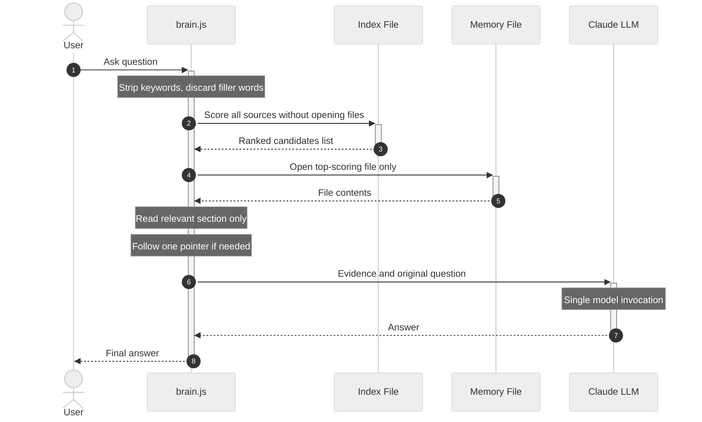

# Second Brain for Claude Code — Summary

> Use Claude Fable 5 to build a personalized workspace memory system that retrieves knowledge through deterministic code instead of expensive model calls, cutting token usage by ~40%.

**Sources:**
- [YouTube: "Build your Ultimate Second Brain with Claude Fable 5 (before it's too late)"](https://www.youtube.com/watch?v=VoKiKvgpk78) — Jay E | RoboNuggets (13:41)
- PDF: "Second Brain — Principles and Starter Prompts" — Jay E | RoboNuggets

*Generated: 2026-07-28*

---

## Problem Statement

Default Claude Code retrieves files the expensive way: when asked a question like "which TTS voice do we use?", it runs grep and glob commands across the workspace, opening and reading many files until it finds the answer. This approach consumes 50,000 or more tokens for a query that should cost 30,000 — a 40% waste that compounds across every session.

Obsidian-style knowledge graphs have become the popular visual answer to workspace organization, but they solve the wrong problem. A graph that shows pretty connections between notes is "just for show" — it provides no functional retrieval advantage. You can see how many files you have, but Claude Code still has to search through them the slow, expensive way.

There is also a structural gap in how developers think about their agentic workflow. Most people focus on individual prompts or tasks, but miss the four layers that make an agentic operating system coherent: Applications (what tools Claude can reach), Routines (what runs automatically), Memory (what the workspace knows), and Skills (what behaviors are available). Without explicit structure across all four layers, the workspace grows organically into an unindexed pile that gets harder to navigate as it grows.

Finally, every workspace is different — the author's file organization, project history, and working patterns are not yours. A system built from someone else's template will fit badly. What transfers across workspaces are principles, not configurations.

---

## Solution at a Glance

The Second Brain system is a personalized knowledge retrieval layer built by Claude Fable 5 itself: it studies current best practices, audits your specific workspace, consults proven open-source memory projects, and builds a custom retrieval script (`brain.js`) backed by a small index file. When you ask a question, deterministic code strips the keywords, scores all candidate sources using only the index (without opening any files), opens the single best-matching file, reads only the relevant section, and hands the evidence to the model for a one-shot answer — resulting in faster retrieval at roughly 40% lower token cost than default Claude Code.

---

## Part I: Conceptual Overview

### Purpose

The central design philosophy is to shift the "dumb" work of retrieval — keyword extraction, candidate scoring, section-finding — from expensive model calls to millisecond-fast deterministic code. The model is smart and expensive; it should only be invoked once, at the end, when the evidence is already assembled. Everything before that final step is a coding problem, not an AI problem.

The second philosophical pillar is workspace-specificity. Rather than prescribing a fixed folder structure or a specific knowledge graph tool, the approach asks Claude Fable 5 to first research what is currently working for practitioners, then read your workspace as it actually exists, then combine the two into a plan that fits your specific files, folders, and habits.

### Core Concepts

Five numbered principles govern how to guide Fable through the build:

1. **Research before you build.** Use the `/last30days` skill (by Matt Van Horn, Lyft co-founder) to sweep Reddit, X, YouTube, and Hacker News for current second-brain best practices. Combine that research with a full workspace scan before planning anything. This prevents building on stale assumptions — and the starter prompt explicitly asks Fable to interview you with at least three questions before touching anything.

2. **Stand on proven shoulders.** Four open-source memory projects are worth studying: Karpathy's LLM wiki (plain markdown, small index), QMD by Tobi Lütke/Shopify (semantic search), GBrain by Garry Tan/YC (self-cleaning, source-citing), and Graphify (YC-funded, graph-based connections). Fable should study each and extract specific ideas that fit your workspace — not copy any wholesale.

3. **Deterministic code before the model.** The retrieval ladder climbs these steps without invoking the model at any point: strip keywords → score sources from the index without opening files → open only the top scorer → read only the relevant section → follow one pointer if that section redirects elsewhere → then and only then hand evidence to the model for a single answer.

4. **Keep a small index of everything.** A single catalog file with one-line entries (name, file link, one-sentence description) makes the scoring step possible. The index must update automatically every time a new memory is saved — so it never drifts from reality. A routing note in CLAUDE.md tells every session to check the index first, open files second.

5. **Make it prove itself.** Have Fable design a fair test: the same real questions answered by default Claude Code vs. the second brain path. Compare token counts with `/context` and wall-clock time. If the brain does not clearly win, keep optimizing. The `/goal` command with a hard pass-fail criterion lets Fable test its own build and iterate without supervision.

```mermaid
%%{init: {'theme': 'neutral'}}%%
flowchart LR
    classDef problemCls  fill:#ffebee,stroke:#c62828,color:#b71c1c
    classDef solutionCls fill:#e8f5e9,stroke:#2e7d32,color:#1b5e20
    classDef processCls  fill:#e3f2fd,stroke:#1565c0,color:#0d47a1
    classDef dataCls     fill:#f3e5f5,stroke:#6a1b9a,color:#4a148c
    classDef outCls      fill:#fafafa,stroke:#757575,color:#424242

    subgraph PROB["Problem Space — Default Claude Code"]
        P1["Expensive model calls\nfor file retrieval"]:::problemCls
        P2["50k+ tokens\nper simple query"]:::problemCls
        P3["Slow grep/glob\nfile search"]:::problemCls
    end

    subgraph SOL["Second Brain Solution"]
        direction TD
        S1["Deterministic brain.js\nno model calls for retrieval"]:::solutionCls
        S2["Small index file\none-line entry per memory"]:::solutionCls
        S3(["5 Build Principles"]):::solutionCls
    end

    subgraph LAYERS["4-Layer Agentic OS"]
        direction TD
        L1["Applications\nMCP / APIs / CLIs"]:::processCls
        L2["Routines\nScheduled automations"]:::processCls
        L3[("Memory\n35k+ mapped files")]:::dataCls
        L4["Skills\nCustom behaviors"]:::processCls
    end

    subgraph OUT["Measured Outcomes"]
        O1["~40% token savings\n30k vs 50k tokens"]:::outCls
        O2["Faster retrieval\nthan default Claude Code"]:::outCls
        O3["Self-verified build\nvia /goal testing"]:::outCls
    end

    PROB -- "motivates" --> SOL
    SOL -- "organizes into" --> LAYERS
    SOL -- "delivers" --> OUT
```

### Strengths

- **Measurable efficiency.** The approach is validated by a direct comparison: 30,000 tokens vs. 50,000 tokens for the same query — approximately 40% savings. Speed also improves visibly: in the live demo, the second brain session answered before the default session had finished searching.

- **Workspace-native.** Because Fable studies your actual files and folders before designing the system, the result reflects how you actually organize information, not how someone else does.

- **Self-testing.** The `/goal` mechanism turns quality verification into an automated loop: Fable tests, measures, and iterates until the pass-fail criterion is met — without continuous supervision from the user.

- **Visual overview for teams and clients.** The graph visualization of the 4-layer OS makes the agentic workspace legible to stakeholders, showing which applications are connected, which routines are running, and which memories and skills are available — enabling quick audits of what can be disconnected or retired.

- **Community-grounded design.** The research-first approach ensures the system learns from what is currently working across the practitioner community, not from the author's preferences alone.

### Weaknesses

- **Time-intensive initial build.** The guide estimates one to two hours with Fable doing the heavy lifting, plus active check-ins between phases. This is not a one-click setup.

- **Requires a workspace with history.** The brain needs existing notes, projects, and memory files to organize. A fresh workspace provides too little signal for Fable to build a meaningful system.

- **Fable-5 dependent.** The guide positions this as something to do "while Fable 5 is still part of the subscription." If pricing changes to usage-based, the build cost increases significantly.

- **Index drift risk.** The system's retrieval advantage depends entirely on the index remaining accurate. If automatic index updates are not implemented correctly, the catalog drifts and retrieval quality degrades silently.

- **JavaScript coupling.** The `brain.js` implementation is described at a high level; the specific logic is workspace-specific. Teams who do not use JavaScript or who work in restricted environments may face integration friction.

### Tradeoffs

| Gain | Loss |
|---|---|
| ~40% token cost reduction per retrieval | 1–2 hours of initial build and iteration time |
| Faster file-finding than grep/glob | Ongoing responsibility to maintain the index |
| Workspace-specific fit | Cannot reuse another user's system; must build your own |
| Single model invocation per query | Deterministic code adds a software maintenance surface |
| Self-verified quality via /goal loop | Fable-5 subscription requirement for the build phase |

### Costs & Caveats

**Prerequisites:** Claude Code with Fable 5 (currently included in the subscription), a workspace with accumulated files and memory, and 1–2 hours for the initial build. The `/last30days` skill by Matt Van Horn is recommended for the research phase but not required.

**Learning curve:** The five principles are straightforward to follow via copy-paste starter prompts, but understanding why each step matters — especially the deterministic retrieval ladder — requires reading through the reasoning. Skipping the research phase risks building a system that optimizes for the wrong patterns.

**Failure modes:** If the index file is not set up to auto-update on every new memory save, the catalog drifts and scoring becomes unreliable. If the `/goal` verification step is skipped, the system may appear to work while actually consuming more tokens than the default. The "make it prove itself" principle exists precisely because these failure modes are non-obvious.

**Pricing window:** The guide explicitly frames this as a time-limited opportunity: Fable 5 is currently available at flat subscription pricing, making a long build session essentially free. Under future usage-based pricing, the same build would carry a measurable cost.

---

## Part II: Technical & Architectural Overview

### Architecture Overview

The system has two distinct layers: a **visual layer** (an interactive graph mapping the 4-layer agentic OS) and a **retrieval layer** (the deterministic `brain.js` script backed by an index file).

The visual layer provides situational awareness — which applications are connected, which routines are active, which files exist in memory, which skills are available. It can open files directly from the graph, serving as a replacement for the OS file explorer for known filenames.

The retrieval layer is the functional core. It is invoked every time Claude needs to answer a question from memory, and it is designed so that only the final step involves the AI model.

### Key Components

**brain.js** — A custom JavaScript script generated by Fable for the specific workspace. Serves as the entry point for every retrieval task: strips keywords, runs the scoring ladder against the index, opens the minimum necessary files, and assembles the evidence package for the model.

**Index file** — A small catalog where every memory in the workspace has a one-line entry: name, file link, one-sentence description. This is the only thing `brain.js` reads during the scoring phase — what makes candidate ranking fast and free of model calls. The index must auto-update whenever a new memory is saved.

**Routing instruction in CLAUDE.md** — A short note telling every Claude Code session to check the index first and open files second. This ensures the second brain path is taken by default, not bypassed.

**Visual graph interface** — An interactive browser-based view of the 4-layer OS, with nodes for every connected application, active routine, memory file, and skill. Files and skills can be opened directly from the graph. Fable is instructed to use `/goal` constraints (e.g., "no lag when moving nodes", "reloads in under 10 seconds") to self-verify the interface quality.

### Technology Choices

- **JavaScript (brain.js):** Chosen because it can run directly within Claude Code's environment. The deterministic scoring and keyword-stripping logic does not require model inference and executes in milliseconds.
- **Markdown files:** All memory is stored as plain markdown — consistent with Karpathy's "LLM wiki" principle of keeping the storage format human-readable and model-accessible without special parsing.
- **Index-first design:** Inspired by the Karpathy wiki approach — a small, always-accurate catalog that enables scoring without opening files.
- **Semantic search inspiration:** QMD (Tobi Lütke) is referenced as a source of ideas for meaning-based matching, though the specific implementation is workspace-generated by Fable.

### Data Flows

**Retrieval flow (read path):** User question → `brain.js` strips to keywords → index scored without opening files → single highest-scoring file opened → relevant section extracted → one pointer followed if the section redirects → evidence + question sent to LLM → answer returned to user.

**Storage flow (write path):** New memory created → file written to workspace → index updated with one-line entry → routing instruction ensures next session will find it.

**Test/verification flow:** Same question sent to default Claude Code and to second brain path simultaneously → `/context` token counts compared → wall-clock time compared → if second brain does not clearly win, `brain.js` is revised and retested via `/goal` loop.

---

## External References

- [Karpathy's LLM Wiki gist](https://gist.github.com/karpathy/442a6bf555914893e9891c11519de94f) — Plain markdown memory architecture; the foundation reference for the index-first approach
- [QMD by Tobi Lütke (Shopify)](https://github.com/tobi/qmd) — "Query My Docs"; applies semantic search to personal memory systems
- [GBrain by Garry Tan (YC CEO)](https://github.com/garrytan/gbrain) — Self-cleaning second brain that cites sources in answers
- [Graphify (YC-funded)](https://github.com/safishamsi/graphify) — Graph-based connections between notes and files
- [RoboNuggets community (skool.com)](https://skool.com/robonuggets) — Full importable system + video walkthrough by Jay E

---

## Source Material

1. **Video:** "Build your Ultimate Second Brain with Claude Fable 5 (before it's too late)" — Jay E | RoboNuggets, YouTube, 13:41. [https://www.youtube.com/watch?v=VoKiKvgpk78](https://www.youtube.com/watch?v=VoKiKvgpk78)
2. **PDF:** "Build your own Second Brain — Principles and Starter Prompts" — Jay E | RoboNuggets. Local: `Second Brain - Principles and Starter Prompts.pdf`

---

## Key Takeaways

- **Deterministic code is the key insight, not the visualization.** The 40% token savings come from a scoring algorithm, not a pretty graph. The graph is 30% of the value; the functional retrieval layer is 70%.
- **Every workspace is different — principles transfer, not systems.** Do not copy someone else's folder structure or memory schema. Give Fable the five principles and let it build a system shaped by how your workspace actually works.
- **The index is the load-bearing component.** The entire retrieval speed advantage depends on a catalog that is always accurate. Auto-updating the index on every new memory save is not optional — it is the system's critical maintenance invariant.
- **Build verification is non-negotiable.** A second brain that looks complete but does not measurably beat the default is worse than none — it adds complexity without benefit. The `/goal` self-test loop is the mechanism that makes the benefit real and measurable.
- **The pricing window is part of the argument.** The case for doing this now is explicit: Fable 5 at subscription pricing makes a multi-hour iterative build essentially free — a deliberate arbitrage opportunity against future usage-based pricing.

---

## Conclusion

The Second Brain for Claude Code is a well-reasoned, practically demonstrable approach to workspace memory that sits between a conceptual framework and a concrete implementation. It is not yet widely standardized — the system is built fresh for each workspace — but the principles behind it (deterministic retrieval, index-first scoring, self-verified quality) are grounded in sound software design and corroborated by real measurement. The approach is best suited to practitioners who already have a meaningful body of notes and files in Claude Code and who use it heavily enough that token costs are a real concern. The single most important caveat is index maintenance discipline: a drifting catalog quietly degrades the system's core advantage until the second brain becomes no better than default.
